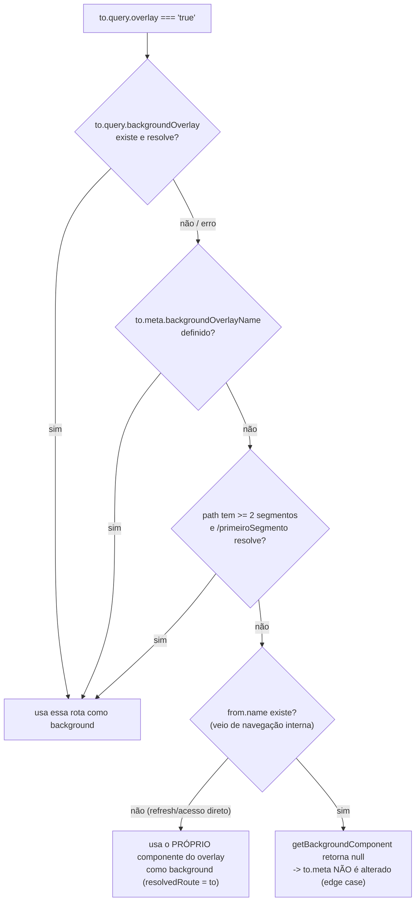
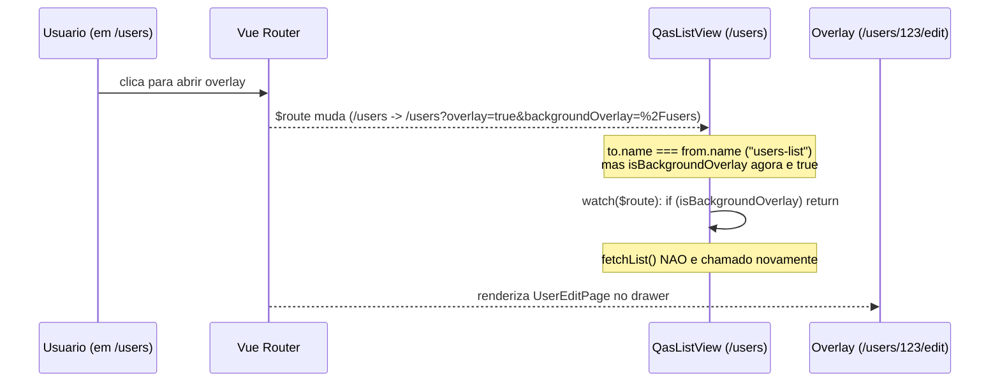
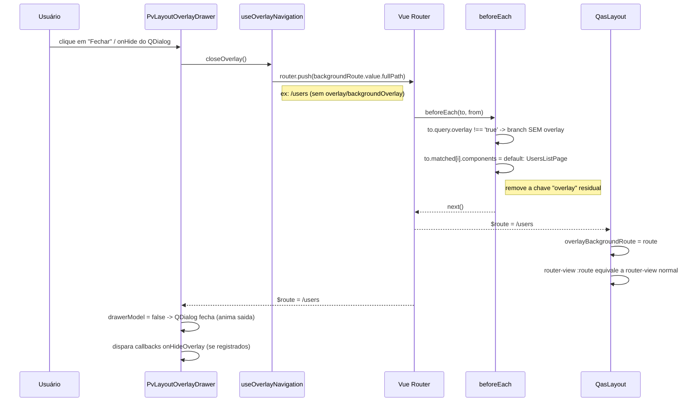

# Relatório Completo — Overlay Navigation (Asteroid / Quasar)

> Objetivo deste documento: descrever **em profundidade** como funciona o sistema de "Navegação em Overlay" (rotas que abrem em um painel lateral/drawer sobre a tela atual) implementado no `asteroid` (Quasar UI Framework + Quasar App Extension), incluindo todos os arquivos envolvidos, a lógica passo a passo, a estrutura de rotas e a API do composable de controle. Ao final, há uma seção dedicada com um **guia de adaptação para Nuxt 3 + Nuxt UI**, pensada para ser usada por um agente de IA como referência de implementação em outro projeto.

## Índice

1. **Visão geral / conceito** — o que é o overlay navigation, motivações e resumo de 30s do mecanismo.
2. **Mapa de arquivos envolvidos** — tabela com todos os arquivos relevantes e seus papéis.
3. **App Extension — como o boot é registrado** — `quasar.boot.push`, ordem de execução, alias `asteroid`.
4. **Estrutura de rotas** — `meta.useOverlay`, query params (`overlay`, `backgroundOverlay`), `matchedIndex`.
5. **Boot file `overlay-navigation.js`** — lógica passo a passo do `beforeEach` e suas 4 estratégias de fallback.
6. **Composable `useOverlayNavigation`** — API completa (estado, computeds, funções, callbacks).
7. **Componentes de layout** — `QasLayout` e `PvLayoutOverlayDrawer` (renderização dual).
8. **Componentes que reagem ao overlay** — `QasRouterLink`, `QasContainer`, `QasBox`, `QasDrawer`, etc.
9. **Fluxos completos passo a passo** — abrir, navegar, fechar, expandir, refresh (com diagramas).
10. **Edge cases, limitações e pontos de atenção** — comportamentos não-óbvios e recomendações.
11. **Adaptação para Nuxt 3 + Nuxt UI** — guia de port (estado SSR-safe, middleware, renderização dual, composable, componentes).
12. **Checklist de implementação para o agente de IA** — passo a passo acionável, por fases.

---

## 1. Visão geral / conceito

"Overlay" é uma rota que é renderizada **dentro de um drawer lateral** (painel deslizante), por cima da tela atual, **sem desmontar** a tela de fundo (background). Pense em duas camadas independentes que coexistem:

- **Background**: a rota/página que estava visível antes de abrir o overlay. Continua montada e visível "atrás" do drawer.
- **Overlay**: a nova rota, renderizada dentro de um `QasDrawer` (painel lateral), por cima do background.

### Por que isso existe?

- Permite fluxos do tipo **lista → detalhes** sem perder o estado/scroll da listagem.
- Evita reload completo de página e remontagem de layouts pesados (menus, app-bar etc).
- Mantém um **histórico de navegação próprio** dentro do overlay (voltar/avançar sem sair do contexto).
- Permite **comunicação entre as duas camadas** (background ↔ overlay) via callbacks/eventos (ex: ao salvar um registro no overlay, atualizar a lista em background).
- Permite "expandir" o overlay para tela cheia (ex: o usuário quer editar com mais espaço) e "fechar" o overlay voltando para o background.

### Mecanismo central (resumo de 30 segundos)

1. Uma rota é marcada com `meta.useOverlay = true` (geralmente na rota raiz/layout, e é **herdada** pelas rotas filhas).
2. Para abrir algo em overlay, navega-se para a rota desejada acrescentando as **query params**:
   - `overlay=true`
   - `backgroundOverlay=<URL atual codificada com encodeURIComponent>`
3. Um **boot file** (guard global `router.beforeEach`) intercepta essa navegação **antes** dela acontecer e:
   - Resolve o componente da rota de destino (que vai virar o conteúdo do **overlay**).
   - Resolve o componente da rota de **background** (a partir da query `backgroundOverlay`, de uma meta fixa, ou de fallback automático).
   - Registra essas informações em `to.meta` (`backgroundRoute`, `overlayBackgroundResolvedRoute`) e ajusta `to.matched[...].components` para conter as **named views** `default` (background) e `overlay` (conteúdo do drawer).
4. O **layout principal** (`QasLayout`) renderiza:
   - `<router-view :route="overlayBackgroundRoute" />` → o **background** (named view `default`, mas usando uma **rota diferente** da atual quando há overlay).
   - `<pv-layout-overlay-drawer />` → um `QasDrawer` que renderiza `<router-view name="overlay" />`, ou seja, o **conteúdo do overlay**.
5. O composable **`useOverlayNavigation()`** expõe tudo que os componentes precisam: saber se estão dentro do overlay (`isOverlay`), se estão no background com overlay aberto (`isBackgroundOverlay`), navegar fechando/expandindo o overlay, manter um histórico de navegação interno do overlay, e disparar/escutar eventos entre as duas camadas.

---

## 2. Mapa de arquivos envolvidos

| Arquivo | Papel |
|---|---|
| `app-extension/src/index.js` | **App Extension** do Quasar — registra o boot `overlay-navigation.js` (entre outros) no projeto consumidor. |
| `app-extension/src/boot/overlay-navigation.js` | **Coração do sistema**. Boot file que registra um `router.beforeEach` global, resolve os componentes de overlay/background e monta as named views. |
| `app-extension/src/boot/before-each.js` | Outro `beforeEach` (histórico de navegação simples + filtros padrão) — roda **depois** do boot de overlay. |
| `ui/src/composables/use-overlay-navigation.js` | **Composable central** — estado compartilhado (histórico, lock de saída), callbacks entre camadas, helpers de rota (`getOverlayRoute`, `closeOverlay`, `expandOverlay` etc). |
| `ui/src/composables/index.js` | Index de composables — exporta `useOverlayNavigation`. |
| `ui/src/components/layout/QasLayout.vue` | Layout principal da aplicação. Renderiza o `router-view` de background + monta o drawer do overlay. |
| `ui/src/components/layout/private/PvLayoutOverlayDrawer.vue` | Componente privado: o **drawer** do overlay em si (`QasDrawer` + `<router-view name="overlay" />` + botões voltar/avançar/fechar/expandir). |
| `ui/src/components/router-link/QasRouterLink.vue` | `<router-link>` "inteligente": decide se navega normalmente ou via `getOverlayRoute()`. |
| `ui/src/components/drawer/QasDrawer.vue` | Drawer genérico (usado pelo `PvLayoutOverlayDrawer` e por outros drawers do sistema). Tem ciência de `isOverlay` para ajustar largura/classe CSS. |
| `ui/src/components/container/QasContainer.vue` | Remove paddings/bordas de container quando `isOverlay`. |
| `ui/src/components/box/QasBox.vue` | Ajusta `outlined`/`unelevated` por padrão quando `isOverlay`. |
| `ui/src/components/page-header/QasPageHeader.vue` | Esconde breadcrumbs quando `isOverlay`. |
| `ui/src/components/form-view/QasFormView.vue` | Trava o overlay (`toggleCanLeaveOverlay(false)`) durante submits; esconde botão cancelar quando `isOverlay`. |
| `ui/src/components/list-view/QasListView.vue`, `ui/src/components/filters/QasFilters.vue`, `ui/src/components/single-view/QasSingleView.vue`, `ui/src/components/chart-view/QasChartView.vue` | Usam `isBackgroundOverlay` para **não refazer fetch** quando a tela está em background (evita fetch duplicado quando o overlay abre/fecha). |
| `ui/src/components/infinite-scroll/QasInfiniteScroll.vue` | Ajusta `scrollTarget` para `.pv-layout-overlay-drawer__content` quando `isOverlay`. |
| `ui/src/composables/use-context.js` / `ui/src/mixins/context.js` | Usam `route` (versão "normalizada" do `useOverlayNavigation`) em vez do `route` puro do vue-router, para obter filtros/paginação corretos tanto em background quanto overlay. |
| `ui/src/composables/use-history.js` | Histórico de navegação **geral** da aplicação (não é específico do overlay, mas é citado no `before-each.js`). |
| `docs/src/pages/overlay-navigation.md` | Documentação "produto" (guia rápido) do recurso. |
| `docs/src/pages/composables/use-overlay-navigation.md` | Documentação de referência da API do composable. |

---

## 3. App Extension — como o boot é registrado

O `asteroid` é distribuído como uma **Quasar App Extension** (`app-extension/src/index.js`). App Extensions são pacotes npm que se "plugam" no CLI do Quasar (`@quasar/app-vite` / `@quasar/app-webpack`) e podem:

- Adicionar **boot files** (`quasar.boot.push(...)`) — arquivos executados uma vez na inicialização do app, antes da montagem do Vue, com acesso à instância do `router`, `app` (Vue) etc.
- Adicionar CSS global, plugins do Quasar (Dialog, Loading, Notify), aliases de import, configuração do bundler (Vite/Webpack), etc.

Trecho relevante de `app-extension/src/index.js`:

```js
function extendQuasar (quasar, api, asteroidConfigFile) {
  // Arquivos de boot
  // https://quasar.dev/quasar-cli-vite/boot-files#introduction
  quasar.boot.push(...resolve(
    'boot/overlay-navigation.js',
    'boot/api.js',
    'boot/debug.js',
    'boot/error-pages.js',
    'boot/font-face.js',
    'boot/register.js',
    'boot/loading.js',
    'boot/query-cache.js',
    'boot/store-adapter',
    'boot/before-each.js'
  ))
  // ...
}
```

Pontos importantes:

- **`overlay-navigation.js` é o PRIMEIRO boot da lista.** Isso é proposital: ele precisa registrar seu `router.beforeEach` **antes** de qualquer outro guard (como `before-each.js`), porque ele **manipula `to.matched[...].components`** — outros guards/middlewares que dependem do componente resolvido devem rodar depois dessa manipulação.
- O boot recebe `{ router }` (instância do Vue Router) — é assim que ele acessa `router.beforeEach`, `router.resolve` etc.
- A app extension também configura um **alias de bundler** (`asteroid` → `node_modules/@bildvitta/quasar-ui-asteroid/src/asteroid.js`), permitindo que qualquer arquivo do projeto (e os próprios componentes do asteroid) façam `import { useOverlayNavigation } from 'asteroid'`.

> **Para quem for portar para Nuxt**: o equivalente conceitual de um "boot file com `router.beforeEach`" é um **plugin Nuxt** (`defineNuxtPlugin`) que acessa `useRouter().beforeEach(...)`, ou um **middleware de rota global** (`defineNuxtRouteMiddleware` em arquivo `*.global.ts` dentro de `middleware/`). A ordem de execução dos middlewares globais também importa (são executados em ordem alfabética por padrão, então pode ser necessário prefixar com números, ex: `01.overlay-navigation.global.ts`).

---

## 4. Estrutura de rotas

### 4.1 Marcando rotas como "participantes do overlay"

A flag `meta.useOverlay = true` deve estar em **pelo menos um nível** da árvore de rotas — tipicamente na rota raiz/layout — pois o boot verifica **todos os registros casados** (`to.matched`):

```js
const useOverlay = to.matched.some(item => item.meta.useOverlay)
if (!useOverlay) return next()
```

Ou seja, **rotas filhas herdam automaticamente** o comportamento de overlay se qualquer rota pai tiver `meta.useOverlay = true`. Exemplo real (`docs/src/router/routes.js`):

```js
const routes = [
  {
    path: '/',
    name: 'Root',
    component: () => import('src/layouts/DocLayout.vue'),
    meta: { useOverlay: true }, // <- toda a árvore abaixo de "Root" participa do overlay
    children: getPages()
  },
  // rotas de erro (NotFound, Forbidden, etc) ficam FORA dessa árvore,
  // portanto não participam do overlay.
]
```

Outro exemplo (do guia de uso, `docs/src/pages/overlay-navigation.md`):

```js
// routes/users.js
export default [
  {
    name: 'UsersList',
    path: '/users',
    meta: { useOverlay: true },
    component: () => import('./pages/UsersList.vue')
  },
  {
    name: 'UsersEdit',
    path: '/users/:id',
    meta: { useOverlay: true },
    component: () => import('./pages/UsersEdit.vue')
  }
]
```

### 4.2 Query params usados pelo sistema (contrato de URL)

| Query param | Tipo | Significado |
|---|---|---|
| `overlay` | `'true'` (string) | Indica que a rota atual deve ser renderizada **dentro do drawer** (overlay), e que a rota de background deve ser calculada/preservada. |
| `backgroundOverlay` | string (URL **codificada** com `encodeURIComponent`) | `fullPath` da rota que deve continuar visível **atrás** do overlay. Pode conter sua própria query string (ex: `%2Fcustomers%3Ftab%3Dinfo`). |

Essas duas queries **viajam juntas** durante toda a navegação dentro do overlay (ver composable, função `getOverlayRoute`).

### 4.3 Meta adicionais

| Meta | Definida por | Uso |
|---|---|---|
| `meta.useOverlay` | Desenvolvedor (na definição da rota) | Habilita o sistema de overlay para a rota e seus filhos. |
| `meta.backgroundOverlayName` | Desenvolvedor (opcional, na definição da rota) | Define **manualmente** o nome de uma rota fixa para servir de background, independente da query `backgroundOverlay`. Útil quando o overlay pode ser aberto a partir de várias telas diferentes, mas deve **sempre** mostrar a mesma tela de fundo. |
| `meta.backgroundRoute` | **Gerada automaticamente** pelo boot | Versão simplificada (`name`, `params`, `fullPath`, `path`, `query`) da rota de background. Consumida pelo composable (`backgroundRoute` computed). |
| `meta.overlayBackgroundResolvedRoute` | **Gerada automaticamente** pelo boot | Rota de background **totalmente resolvida** (com `matched` e componentes assíncronos já resolvidos). Consumida pelo `QasLayout` via `<router-view :route="...">`. |

### 4.4 Rotas aninhadas (nested routes) e o "matchedIndex"

Cenário: uma listagem de clientes (`/customers`) abre um overlay de detalhes (`/customers/:id`), e essa tela de detalhes **também tem um layout próprio com sub-rotas** (abas), por exemplo `/customers/:id/summary`, `/customers/:id/orders`.

```text
to.matched = [
  { path: '/' },                    // index 0 — Root (layout principal)
  { path: '/customers/:id' },       // index 1 — layout do "detalhe" (precisa ser o componente do overlay)
  { path: '/customers/:id/summary' } // index 2 — conteúdo da aba
]
```

Nesse caso, o **componente do overlay precisa ser o de índice 1** (`/customers/:id`), pois ele é o layout pai que renderiza as abas internamente — não faz sentido o overlay mostrar só o conteúdo da aba "summary" sem o layout/abas ao redor.

A regra usada no boot é simples:

```js
const matchedIndex = to.matched.length > 1 ? 1 : 0
```

> Ou seja: se a rota tiver **mais de 2 níveis** (Root + algo + algo), o componente do overlay é o **segundo nível** (`index 1`). Se a rota tiver só 1 ou 2 níveis (ex: `Root` + a própria página), usa o `index 0`.

---

## 5. Boot file `overlay-navigation.js` — lógica passo a passo

Arquivo: `app-extension/src/boot/overlay-navigation.js`. Este é o arquivo mais importante do sistema. Abaixo, o código completo, seguido de uma explicação passo a passo.

```js
import { useOverlayNavigation } from 'asteroid'

export default async function ({ router }) {
  router.beforeEach((to, from, next) => onBeforeEach(to, from, next, router))
}

async function onBeforeEach (to, from, next, router) {
  const useOverlay = to.matched.some(item => item.meta.useOverlay)

  if (!useOverlay) return next()

  const { addRouteToHistory } = useOverlayNavigation()

  addRouteToHistory(to, from)

  const matchedIndex = to.matched.length > 1 ? 1 : 0

  const { overlay, default: defaultComponent } = to.matched[matchedIndex]?.components || {}

  const overlayComponent = await getResolvedComponent(overlay || defaultComponent)

  // "overlay" vem como string na query da URL.
  if (to.query.overlay === 'true') {
    const backgroundResult = await getBackgroundComponent()

    if (backgroundResult) {
      const { resolvedRoute } = backgroundResult
      const { name, params = {}, fullPath, path, query = {} } = resolvedRoute || {}

      to.meta.backgroundRoute = { name, params, fullPath, path, query }

      await resolveRouteComponents(resolvedRoute)

      to.meta.overlayBackgroundResolvedRoute = resolvedRoute

      // Apenas adicionar o overlay, sem alterar o default
      to.matched[matchedIndex].components = {
        ...to.matched[matchedIndex].components,
        overlay: overlayComponent
      }
    }
  } else {
    to.matched[matchedIndex].components = {
      default: overlayComponent
    }
  }

  next()

  // ...funções auxiliares (ver abaixo)
}
```

### 5.1 Passo 1 — A rota participa do overlay?

```js
const useOverlay = to.matched.some(item => item.meta.useOverlay)
if (!useOverlay) return next()
```

Se **nenhuma** rota da árvore casada tiver `meta.useOverlay`, o guard simplesmente chama `next()` e não faz nada — comportamento de roteamento 100% padrão do Vue Router.

### 5.2 Passo 2 — Atualizar o histórico interno do overlay

```js
const { addRouteToHistory } = useOverlayNavigation()
addRouteToHistory(to, from)
```

Chama a função do composable (ver seção 6.4) que mantém uma pilha de navegação **própria do overlay** (independente do histórico do navegador), usada para os botões "voltar"/"avançar" dentro do drawer e para os computeds `hasPreviousRoute` / `hasNextRoute`.

> Importante: `addRouteToHistory` só faz algo se `to.query.overlay === 'true'` (ver implementação) — navegação "normal" (fora do overlay) não polui esse histórico.

### 5.3 Passo 3 — Determinar o `matchedIndex` e resolver o componente "candidato a overlay"

```js
const matchedIndex = to.matched.length > 1 ? 1 : 0
const { overlay, default: defaultComponent } = to.matched[matchedIndex]?.components || {}
const overlayComponent = await getResolvedComponent(overlay || defaultComponent)
```

- `to.matched[matchedIndex].components` é o objeto de **named views** que o Vue Router monta para aquele nível da rota. Inicialmente, normalmente só existe a chave `default` (a definição padrão `component:` da rota).
- `getResolvedComponent` (helper, ver 5.6) resolve tanto componentes estáticos quanto **lazy** (`() => import(...)`), retornando sempre o componente "pronto".
- Esse `overlayComponent` é o componente que vai virar o **conteúdo do drawer** (a página de destino da navegação).

### 5.4 Passo 4 — Branch SEM overlay (`to.query.overlay !== 'true'`)

```js
to.matched[matchedIndex].components = {
  default: overlayComponent
}
```

Navegação **normal**: o componente resolvido é simplesmente colocado como `default` (comportamento padrão de qualquer `<router-view />`). Nenhum drawer é aberto (`drawerModel` ficará `false`, ver seção 7.2).

> Por que isso é necessário, já que `default` já existia? Porque, em alguns casos, o `to.matched[matchedIndex].components` pode ter sido **modificado por uma navegação anterior em overlay** (que adicionou a chave `overlay`). Esse passo garante que, ao sair do overlay, a estrutura de `components` volte a ter **apenas** `default`, sem resíduos de uma navegação anterior em overlay (evita vazar a chave `overlay` para rotas que não são mais overlay).

### 5.5 Passo 5 — Branch COM overlay (`to.query.overlay === 'true'`)

Aqui está a parte mais complexa. O objetivo é descobrir **qual rota deve continuar aparecendo no fundo (background)** e montar as duas named views.

```js
const backgroundResult = await getBackgroundComponent()

if (backgroundResult) {
  const { resolvedRoute } = backgroundResult
  const { name, params = {}, fullPath, path, query = {} } = resolvedRoute || {}

  to.meta.backgroundRoute = { name, params, fullPath, path, query }

  await resolveRouteComponents(resolvedRoute)

  to.meta.overlayBackgroundResolvedRoute = resolvedRoute

  to.matched[matchedIndex].components = {
    ...to.matched[matchedIndex].components,
    overlay: overlayComponent
  }
}
```

1. `getBackgroundComponent()` — função com **4 estratégias em cascata** (detalhadas em 5.7) para descobrir a rota de background.
2. Se encontrou (`backgroundResult` truthy):
   - `to.meta.backgroundRoute` recebe uma versão **simplificada** da rota resolvida (`name`, `params`, `fullPath`, `path`, `query`). Isso é o que o composable expõe como `backgroundRoute` (computed).
   - `resolveRouteComponents(resolvedRoute)` — percorre `resolvedRoute.matched` e resolve **todos** os componentes lazy (`() => import(...)`) **in-place**, substituindo a função pela Promise resolvida. Isso é necessário porque `router.resolve()` **não resolve** componentes assíncronos sozinho — e o `<router-view :route="...">` do `QasLayout` precisa de componentes já prontos para renderizar a hierarquia completa (layout pai + filhos) do background.
   - `to.meta.overlayBackgroundResolvedRoute = resolvedRoute` — essa é a rota **completa e resolvida** que o `QasLayout` vai passar para o `<router-view :route="...">` no lugar da rota atual, fazendo o background continuar renderizado mesmo a URL apontando para outra rota.
   - Por fim, `to.matched[matchedIndex].components` ganha a chave **`overlay`** (mantendo o que já existia em `default`, via spread `...to.matched[matchedIndex].components`). É essa chave `overlay` que o `<router-view name="overlay" />` (dentro do drawer) vai renderizar.
3. Se **não** encontrou (`backgroundResult` é `null`) — **nada é alterado** em `to.meta`/`to.matched`. Esse é um caso de borda tratado na seção 10 (Edge cases).

### 5.6 Helper — `getResolvedComponent(component)`

```js
function getResolvedComponent (component) {
  return new Promise((resolve, reject) => {
    if (typeof component === 'function') {
      component().then(module => resolve(module.default)).catch(error => reject(error))
    } else {
      resolve(component)
    }
  })
}
```

Normaliza dois formatos possíveis de componente Vue:

1. **Estático**: já é o objeto do componente (import direto no topo do arquivo).
2. **Lazy**: uma função que retorna `import('./Algo.vue')` — o helper chama a função, espera a Promise e extrai `.default`.

### 5.7 Helper — `getComponentByRoute(route)`

```js
function getComponentByRoute (route) {
  const lastIndex = route.matched.length - 1
  const matched = route.matched[lastIndex]

  const component = matched?.components?.default || matched?.component

  return getResolvedComponent(component)
}
```

Dado um objeto de rota **resolvido** (`router.resolve(...)`), pega o **último nível** (`matched.at(-1)`) e busca o componente em dois formatos possíveis:

- `matched.components.default` — quando a rota usa **named views** (ex: já passou pelo próprio sistema de overlay antes) ou múltiplos componentes.
- `matched.component` (singular, sem "s") — quando a rota define um único componente simples (`component: () => import(...)`).

### 5.8 Helper — `resolveRouteComponents(route)`

```js
async function resolveRouteComponents (route) {
  for (const matched of route.matched) {
    for (const [viewName, comp] of Object.entries(matched.components || {})) {
      matched.components[viewName] = await getResolvedComponent(comp)
    }
  }
}
```

Percorre **todos os níveis** (`route.matched`) e **todas as named views** de cada nível, resolvendo componentes lazy **in-place** (sobrescreve `matched.components[viewName]` com o componente já resolvido). Isso é o que permite ao `QasLayout` renderizar a hierarquia completa do background (ex: `Layout > CustomerLayout > CustomerSummary`) com um único `<router-view :route="resolvedRoute" />`, já que o Vue Router consegue percorrer `route.matched` recursivamente quando os componentes já estão prontos (não-função).

### 5.9 Helper — `getBackgroundComponent()` (as 4 estratégias de fallback)

Esta é a função que decide **qual rota fica atrás do overlay**. Ela tenta, em ordem, 4 estratégias, retornando no primeiro sucesso (`{ component, resolvedRoute }`) ou `null` se nenhuma funcionar.

#### Estratégia 1 — Query `backgroundOverlay` (caminho normal)

```js
const backgroundPath = to.query.backgroundOverlay

if (backgroundPath) {
  try {
    const normalizedURL = decodeURIComponent(backgroundPath) // "/customers?tab=info"
    const queryString = normalizedURL.split('?')[1]          // "tab=info"
    const queryParams = normalizedURL ? new URLSearchParams(queryString) : {}

    const queryObject = {}
    queryParams.forEach((value, key) => { queryObject[key] = value })

    const resolvedRoute = router.resolve(normalizedURL)
    const component = await getComponentByRoute(resolvedRoute)

    if (component) {
      return {
        component,
        resolvedRoute: {
          ...resolvedRoute,
          query: queryObject,
          params: resolvedRoute.params
        }
      }
    }
  } catch {
    return null
  }
}
```

- É o caminho **mais comum**: quando o usuário clica em um link com `getOverlayRoute()`, a query `backgroundOverlay` contém a URL atual (codificada), incluindo sua própria query string.
- `decodeURIComponent` desfaz o `encodeURIComponent` aplicado em `getOverlayRoute`.
- A query string da URL de background é extraída manualmente (`URLSearchParams`) e usada como `query` da rota resolvida — isso é necessário porque `router.resolve(string)` separa `path` de `query` automaticamente, mas o resultado precisa ser remontado em formato de objeto `query`.
- Se `router.resolve` ou `getComponentByRoute` lançar erro (ex: rota inválida), o **`catch` retorna `null` imediatamente** — ou seja, **não cai para a estratégia 2** nesse caso específico (comportamento a ter em mente).

#### Estratégia 2 — `meta.backgroundOverlayName` (rota fixa definida pelo desenvolvedor)

```js
const backgroundOverlayName = to.meta?.backgroundOverlayName

if (backgroundOverlayName) {
  try {
    const resolvedRoute = router.resolve({ name: backgroundOverlayName })
    const component = await getComponentByRoute(resolvedRoute)

    return {
      component,
      resolvedRoute: {
        ...resolvedRoute,
        query: to.query,
        params: { ...to.params, ...resolvedRoute.params }
      }
    }
  } catch {
    return null
  }
}
```

- Usada quando a rota **não chegou via `backgroundOverlay`** (ex: o usuário acessou a URL do overlay diretamente, ou um link foi montado manualmente só com `?overlay=true`), mas a rota tem `meta.backgroundOverlayName` configurado.
- Reaproveita `to.query` e `to.params` (mescla com os params resolvidos da rota de background) — útil quando a rota de background compartilha parâmetros com a rota do overlay (ex: ambas usam `:companyId`).

#### Estratégia 3 — Fallback automático pelo primeiro segmento da URL

```js
const segments = to.path.split('/').filter(Boolean)

if (segments.length >= 2) {
  const basePath = `/${segments[0]}`

  try {
    const resolvedRoute = router.resolve(basePath)
    const component = await getComponentByRoute(resolvedRoute)

    if (component) {
      return {
        component,
        resolvedRoute: {
          ...resolvedRoute,
          query: to.query,
          params: { ...to.params, ...resolvedRoute.params }
        }
      }
    }
  } catch {
    return null
  }
}
```

- Exemplo: a URL atual é `/customers/123/edit` → segmentos `['customers', '123', 'edit']` → tenta resolver `/customers` como rota de background.
- Só roda se a URL tiver **2 ou mais segmentos** (ou seja, a rota do overlay não está na raiz).
- É o fallback "razoável" quando não há `backgroundOverlay` nem `backgroundOverlayName`: assume que a "rota pai" (primeiro segmento) é uma listagem que faz sentido como background.

#### Estratégia 4 — Fallback final (refresh de página / navegação direta)

```js
if (!from.name) return { component: overlayComponent, resolvedRoute: to }

return null
```

- `from.name` é `undefined` quando a navegação **não veio de uma rota interna** — tipicamente um **F5 (refresh)** ou acesso direto pela URL.
- Nesse caso, **não existe "página anterior"** para servir de background. A solução adotada é usar **a própria rota/componente do overlay como background** (`resolvedRoute: to`, `component: overlayComponent`) — ou seja, a tela renderiza a mesma página tanto no `default` quanto no `overlay`, e o drawer abre por cima de "si mesma". Evita tela em branco atrás do drawer.
- Se nada disso se aplicar (tem `from.name`, ou seja, é navegação SPA normal, mas nenhuma estratégia anterior resolveu) → retorna `null`. Esse é o **edge case** descrito na seção 10.1.

### 5.10 Resumo visual das 4 estratégias



---

## 6. Composable `useOverlayNavigation` — API completa

Arquivo: `ui/src/composables/use-overlay-navigation.js`. É o composable que **toda** a aplicação usa para interagir com o sistema de overlay — desde os componentes de layout (drawer) até componentes de domínio (listagens, formulários).

### 6.1 Estado compartilhado em nível de módulo

```js
const historyRoute = ref({
  history: [],
  nextStack: [],
  currentIndex: -1
})

const canLeaveOverlay = ref(true)

const callbackFunctionsByEntity = new Map()
```

Esses três estados são declarados **fora** da função `useOverlayNavigation`, ou seja, são **singletons em memória** (módulo ES carregado uma única vez), compartilhados por **todas** as instâncias do composable na aplicação:

- **`historyRoute`**: histórico de navegação interno do overlay. **Não é persistido** (perdido em F5) e é **resetado** sempre que o overlay é fechado (`closeOverlay`) ou expandido (`expandOverlay`).
  - `history`: array de rotas visitadas (formato simplificado: `name`, `params`, `fullPath`, `path`, `query`).
  - `currentIndex`: posição atual dentro de `history`.
  - `nextStack`: existe na estrutura mas **não é populado** em nenhum lugar do código atual (campo "morto"/reservado).
- **`canLeaveOverlay`**: trava global — quando `false`, o overlay não pode ser fechado, expandido, nem navegado (botões ficam desabilitados e o `QasDrawer` vira `persistent`). Usado pelo `QasFormView` durante `submit()`.
- **`callbackFunctionsByEntity`**: `Map` que guarda os callbacks registrados (`onCloseOverlay`, `onExpandOverlay`, `onHideOverlay`, `onBackgroundChange`, `onOverlayChange`), agrupados por **"entidade"** (ver 6.2).

### 6.2 Duas formas de instanciar: com ou sem "entidade"

```js
export default function useOverlayNavigation (entity) {
  const callbackFunctions = getCallbackFunctionsByEntity(entity)
  // ...
}

function getCallbackFunctionsByEntity (entity) {
  const entityKey = entity ?? 'default'

  if (!callbackFunctionsByEntity.has(entityKey)) {
    callbackFunctionsByEntity.set(entityKey, createCallbackFunctionsByEntity())
  }

  return callbackFunctionsByEntity.get(entityKey)
}

function createCallbackFunctionsByEntity () {
  return {
    onCloseOverlay: [],
    onExpandOverlay: [],
    onHideOverlay: [],
    onBackgroundChange: [],
    onOverlayChange: []
  }
}
```

| Modo | Exemplo | Comportamento |
|---|---|---|
| **Sem entidade** (legado/padrão) | `useOverlayNavigation()` | Todos os callbacks (`onCloseOverlay`, `onBackgroundChange` etc) de **todas** as instâncias sem entidade compartilham o **mesmo array** (`entityKey = 'default'`). Se duas telas diferentes registrarem `onCloseOverlay` sem entidade, **ambos os callbacks** são chamados quando qualquer overlay fechar. |
| **Com entidade** | `useOverlayNavigation('activities')` | Os **callbacks** ficam isolados por string de entidade. Instâncias com a mesma entidade (`'activities'`) compartilham os callbacks entre si, mas ficam isoladas de outras entidades (`'funnels'`, `'default'`). |

> ⚠️ **`historyRoute` e `canLeaveOverlay` são SEMPRE globais**, independente da entidade — só os **callbacks** são isolados por entidade.

> 💡 Recomendação (presente na doc oficial): sempre usar entidade quando o composable for usado em **contextos específicos** (ex: lista de atividades, funis), para evitar que callbacks de uma tela "vazem" para outra.

### 6.3 Constante via `inject` — `isOverlay`

```js
const isOverlay = inject('isOverlay', false)
```

- `isOverlay` é fornecido (`provide('isOverlay', true)`) **apenas** pelo `PvLayoutOverlayDrawer.vue` (o drawer do overlay) — ver seção 7.2.
- Qualquer componente renderizado **dentro** da árvore do drawer recebe `isOverlay === true` via injeção.
- Qualquer componente fora dessa árvore (ex: a página em background) recebe o valor padrão `false`.
- É a forma mais simples e direta de um componente saber: **"estou sendo renderizado dentro do drawer de overlay agora?"**

### 6.4 Computeds

```js
const backgroundRoute = computed(() => route.meta.backgroundRoute || {})

const hasOverlay = computed(() => route?.query?.overlay === 'true')

const isBackgroundOverlay = computed(() => !isOverlay && hasOverlay.value)

const defaultRoute = computed(() => {
  return isBackgroundOverlay.value ? backgroundRoute.value : route
})

const hasPreviousRoute = computed(() => historyRoute.value.currentIndex > 0)

const hasNextRoute = computed(() => historyRoute.value.currentIndex < historyRoute.value.history.length - 1)
```

| Computed | O que retorna | Quando usar |
|---|---|---|
| **`backgroundRoute`** | `route.meta.backgroundRoute` (objeto simplificado gerado pelo boot) ou `{}` se não existir. | Saber qual é a rota que está "atrás" do overlay atual. |
| **`hasOverlay`** | `true` se a rota atual tem `?overlay=true` — **independente** de o componente atual ser o overlay ou o background. | Checagem de baixo nível; geralmente você quer `isOverlay` ou `isBackgroundOverlay` em vez deste. |
| **`isBackgroundOverlay`** | `true` quando: **não estou** dentro do overlay (`!isOverlay`) **E** existe um overlay aberto (`hasOverlay`). Ou seja: **sou a tela de fundo, e tem um drawer aberto por cima de mim agora**. | Em listagens/formulários: evitar refetch quando o `$route` muda só por causa da abertura/fechamento do overlay (ver seção 9.3). |
| **`route`** *(exportado, mas internamente é `defaultRoute`)* | Se `isBackgroundOverlay` → retorna `backgroundRoute.value` (a rota "congelada" do background). Caso contrário → retorna o `route` normal do vue-router (`useRoute()`). | **Substituto direto de `useRoute()`** para qualquer componente que precise ler `query`/`params`/`name` de forma consistente, **tanto em background quanto dentro do overlay**. Exemplo de uso real: tela de listagem que lê `route.query.status` — quando um overlay abre por cima dela, a URL muda e a query `status` "desapareceria" da `useRoute()` normal; usando `route` do `useOverlayNavigation()`, a listagem continua enxergando `status` (porque vem de `backgroundRoute`, que preserva a query original). |
| **`hasPreviousRoute`** | `true` se existe uma posição anterior no `historyRoute.history`. | Habilitar/desabilitar botão "voltar" do drawer. |
| **`hasNextRoute`** | `true` se existe uma posição seguinte no `historyRoute.history`. | Habilitar/desabilitar botão "avançar" do drawer. |

> Note que o composable **retorna** `route: defaultRoute` (renomeado), exatamente para que o consumidor possa fazer `const { route } = useOverlayNavigation()` e usar `route.value.query...` como se fosse o `useRoute()` padrão (mas "ciente" do overlay).

### 6.5 Helpers de rota — `getOverlayRoute` e `getNormalizedRoute`

#### `getOverlayRoute(externalRoute)`

```js
function getOverlayRoute (externalRoute) {
  return {
    ...externalRoute,
    query: {
      ...externalRoute.query,
      overlay: true,
      ...(!isOverlay && { backgroundOverlay: encodeURIComponent(route.fullPath) }),
      ...(route.query.backgroundOverlay && { backgroundOverlay: route.query.backgroundOverlay })
    }
  }
}
```

Esta é a função usada para **construir o objeto de rota** que será passado para `router.push(...)` (ou `:to` de um `<router-link>`) para abrir algo em overlay. Lógica da query `backgroundOverlay`:

1. **Sempre** seta `query.overlay = true`.
2. **Se quem está chamando NÃO está dentro de um overlay** (`!isOverlay`, ou seja, estou na tela "normal"/background), define `backgroundOverlay = encodeURIComponent(route.fullPath)` — ou seja, **"a URL atual (a minha) vira o background do próximo overlay"**.
3. **Se a rota atual JÁ tem `backgroundOverlay` na query** (ou seja, eu **já estou dentro de um overlay** e estou navegando para outra tela **dentro do mesmo overlay**), **propaga o `backgroundOverlay` já existente** — assim o background original (de antes de abrir o overlay) **não muda** mesmo navegando várias vezes dentro do drawer.

> A combinação dos itens 2 e 3 garante que `backgroundOverlay` sempre aponte para a **última tela "normal"** antes de qualquer navegação em overlay, não importa quantos níveis de navegação aconteçam dentro do drawer.

Exemplo de uso:

```js
const { getOverlayRoute } = useOverlayNavigation()

const overlayRoute = getOverlayRoute({ name: 'UsersEdit', params: { id: 123 } })
// { name: 'UsersEdit', params: { id: 123 }, query: { overlay: true, backgroundOverlay: '%2Fusers%3Fpage%3D2' } }

router.push(overlayRoute)
```

#### `getNormalizedRoute(routePayload)`

```js
function getNormalizedRoute (routePayload) {
  return isOverlay ? getOverlayRoute(routePayload) : routePayload
}
```

Função "auto-detect": **se o componente atual está dentro do overlay**, aplica `getOverlayRoute` (preservando o contexto de overlay); **caso contrário**, retorna a rota como está (navegação normal). É útil em componentes "neutros" que podem ser renderizados tanto dentro quanto fora do overlay e precisam gerar links que "se comportem corretamente" nos dois contextos — por exemplo, abas (tabs) que mudam de rota: se a tela da aba está dentro do overlay, clicar na aba deve continuar dentro do overlay; se não está, deve navegar normalmente.

### 6.6 Controles do overlay — `closeOverlay`, `expandOverlay`, `toggleCanLeaveOverlay`

#### `closeOverlay()`

```js
function closeOverlay () {
  if (!hasOverlay.value) return

  execCallbackFunctions('onCloseOverlay')
  execCallbackFunctions('onHideOverlay')

  const query = { ...route.query }
  delete query.overlay
  delete query.backgroundOverlay

  router.push({ path: backgroundRoute.value.fullPath, query: { ...backgroundRoute.value.query } })

  resetHistory()
}
```

- Não faz nada se não há overlay aberto (`hasOverlay.value === false`).
- Dispara, em ordem: callbacks `onCloseOverlay` e depois `onHideOverlay` (da entidade atual).
- Navega para `backgroundRoute.value.fullPath` **com a query da rota de background** (não a query atual!) — ou seja, **volta exatamente para onde o usuário estava antes de abrir o overlay**, sem `overlay`/`backgroundOverlay`.
- Reseta o histórico interno do overlay (`resetHistory()`).

#### `expandOverlay()`

```js
async function expandOverlay () {
  if (!hasOverlay.value) return

  execCallbackFunctions('onExpandOverlay')
  execCallbackFunctions('onHideOverlay')

  const query = { ...route.query }
  delete query.overlay
  delete query.backgroundOverlay

  await router.push({ ...route, query })

  resetHistory()
}
```

- Mesma guarda inicial.
- Dispara `onExpandOverlay` e `onHideOverlay`.
- **Diferença crucial em relação ao `closeOverlay`**: aqui `router.push({ ...route, query })` mantém **a rota atual** (a que estava sendo exibida **dentro do overlay**), apenas removendo as queries `overlay`/`backgroundOverlay`. Resultado: a tela que estava no drawer agora ocupa a **tela inteira** (deixa de ser um overlay e vira uma navegação normal).
- Também reseta o histórico do overlay.

#### `toggleCanLeaveOverlay(value)`

```js
function toggleCanLeaveOverlay (value) {
  canLeaveOverlay.value = value
}
```

- Liga/desliga a trava global `canLeaveOverlay`.
- Usado pelo `QasFormView` (ver 8.6): `toggleCanLeaveOverlay(false)` no início do `submit()`, `toggleCanLeaveOverlay(true)` no `finally` — evita que o usuário feche/expanda/navegue o overlay **enquanto um formulário está sendo enviado**.

### 6.7 Histórico de navegação do overlay

```js
function addRouteToHistory (to, from) {
  if (to.fullPath === from.fullPath || to.query.overlay !== 'true') return

  const currentRoute = {
    name: to.name, params: to.params, fullPath: to.fullPath, path: to.path, query: to.query
  }

  const existsInHistoryList = historyRoute.value.history.findIndex(item => item.fullPath === to.fullPath)

  if (existsInHistoryList !== -1) {
    historyRoute.value.currentIndex = existsInHistoryList
    return
  }

  const isNavigatingForward = (
    historyRoute.value.currentIndex < historyRoute.value.history.length - 1 &&
    historyRoute.value.history[historyRoute.value.currentIndex + 1]?.fullPath === to.fullPath
  )

  if (isNavigatingForward) {
    historyRoute.value.currentIndex++
    return
  }

  if (historyRoute.value.currentIndex < historyRoute.value.history.length - 1) {
    historyRoute.value.history.splice(historyRoute.value.currentIndex + 1)
  }

  historyRoute.value.history.push(currentRoute)
  historyRoute.value.currentIndex = historyRoute.value.history.length - 1
}

function resetHistory () {
  historyRoute.value.currentIndex = -1
  historyRoute.value.nextStack = []
  historyRoute.value.history = []
}

function goBack () {
  if (!hasPreviousRoute.value) return

  historyRoute.value.currentIndex--
  const targetRoute = historyRoute.value.history[historyRoute.value.currentIndex]

  if (targetRoute) router.push(targetRoute)
}

function goForward () {
  if (!hasNextRoute.value) return

  historyRoute.value.currentIndex++
  const targetRoute = historyRoute.value.history[historyRoute.value.currentIndex]

  if (targetRoute) router.push(targetRoute)
}
```

`addRouteToHistory(to, from)` — chamada pelo boot a **cada navegação** (ver 5.2) — implementa um histórico **estilo navegador** (back/forward stack), mas só para rotas com `overlay=true`:

1. Se `to` e `from` são a mesma URL, ou se `to` não é overlay → não faz nada.
2. Se `to.fullPath` **já existe** no histórico → apenas move `currentIndex` para essa posição (não duplica).
3. Se `to` é exatamente a **próxima** entrada do histórico (`history[currentIndex + 1]`) → é uma navegação "para frente" dentro de uma sequência já conhecida → apenas incrementa `currentIndex`.
4. Caso contrário → é uma **navegação nova**: descarta tudo que estava "à frente" (`history.splice(currentIndex + 1)` — comportamento idêntico ao do `window.history` do navegador ao navegar para um link depois de ter dado "voltar"), empilha a nova rota e aponta `currentIndex` para ela.

`resetHistory()` — zera tudo (`history = []`, `currentIndex = -1`, `nextStack = []`). Chamado por `closeOverlay` e `expandOverlay`.

`goBack()` / `goForward()` — decrementam/incrementam `currentIndex` e fazem `router.push(targetRoute)` para a rota correspondente.

> ⚠️ **Detalhe importante**: os botões de voltar/avançar do `PvLayoutOverlayDrawer` (ver 7.2) **NÃO chamam `goBack()`/`goForward()`** — eles chamam `router.go(-1)` / `router.go(1)` (histórico nativo do navegador). `hasPreviousRoute`/`hasNextRoute` (calculados a partir de `historyRoute`) são usados **apenas para habilitar/desabilitar visualmente os botões**. Isso funciona porque toda navegação em overlay passa por `router.push`, que por sua vez empilha uma entrada no histórico do navegador — então `historyRoute` (índice "lógico") e o histórico do navegador (índice "real") avançam **em paralelo**, de forma sincronizada, **enquanto o usuário não usa os botões voltar/avançar do navegador diretamente**. As funções `goBack`/`goForward` do composable existem como API alternativa (ex.: para construir uma UI de histórico customizada que não dependa do histórico do navegador), mas não são usadas pelos componentes internos do asteroid no momento.

### 6.8 Comunicação entre camadas — `trigger*Change` / `on*Change`

```js
function triggerBackgroundChange (payload) {
  execCallbackFunctions('onBackgroundChange', payload)
}

function triggerOverlayChange (payload) {
  execCallbackFunctions('onOverlayChange', payload)
}

function onBackgroundChange (callback) {
  callbackFunctions.onBackgroundChange.push(callback)
}

function onOverlayChange (callback) {
  callbackFunctions.onOverlayChange.push(callback)
}
```

Mecanismo de **pub/sub simples** para comunicação entre o componente em background e o componente dentro do overlay (ou vice-versa), sem precisar de `provide`/`inject`/`emit` através da árvore de componentes (que não funcionaria aqui, já que background e overlay são **subtrees de `<router-view>` diferentes**, sem relação direta de pai/filho).

| Função | Quem normalmente chama | Quem normalmente escuta |
|---|---|---|
| `triggerBackgroundChange(payload)` | Componente **dentro do overlay** (ex: após salvar um registro) | Componente em **background** (ex: listagem, via `onBackgroundChange`, para dar refresh) |
| `triggerOverlayChange(payload)` | Componente em **background** | Componente **dentro do overlay** |

Exemplo (do guia de uso):

```js
const { onBackgroundChange, triggerOverlayChange } = useOverlayNavigation()

onBackgroundChange((payload) => {
  console.log('Background avisou:', payload)
})

function notifyBackground () {
  triggerOverlayChange({ action: 'refresh-list' })
}
```

> Como os callbacks ficam em arrays (`callbackFunctions.onBackgroundChange.push(...)`), **múltiplos componentes** podem escutar o mesmo evento — todos são chamados em sequência por `execCallbackFunctions`.

### 6.9 Callbacks de ciclo de vida do overlay

```js
function onCloseOverlay (callback) {
  callbackFunctions.onCloseOverlay.push(callback)
}

function onExpandOverlay (callback) {
  callbackFunctions.onExpandOverlay.push(callback)
}

function onHideOverlay (callback) {
  callbackFunctions.onHideOverlay.push(callback)
}
```

| Callback | Disparado quando | Não disparado quando |
|---|---|---|
| `onCloseOverlay` | `closeOverlay()` é chamado (drawer fechado/voltando ao background) | `expandOverlay()` |
| `onExpandOverlay` | `expandOverlay()` é chamado (overlay vira tela cheia) | `closeOverlay()` |
| `onHideOverlay` | **Ambos** os casos acima (overlay deixa de estar visível como drawer, seja fechando ou expandindo) | — |

### 6.10 `removeListeners(target?)` — limpeza de callbacks

```js
function removeListeners (target) {
  if (!target) {
    const defaultCallbackFunctions = callbackFunctionsByEntity.get('default')
    if (!defaultCallbackFunctions) return
    for (const functionKey of Object.keys(defaultCallbackFunctions)) {
      defaultCallbackFunctions[functionKey] = []
    }
    return
  }

  if (typeof target === 'string') {
    const callbackFunctions = callbackFunctionsByEntity.get(target)
    if (!callbackFunctions) return
    for (const functionKey of Object.keys(callbackFunctions)) {
      callbackFunctions[functionKey] = []
    }
    return
  }

  const functionsToRemove = Array.isArray(target) ? target : [target]
  const callbackFunctionsKeys = Object.keys(callbackFunctions)

  for (const key of callbackFunctionsKeys) {
    callbackFunctions[key] = callbackFunctions[key].filter(fn => !functionsToRemove.includes(fn))
  }
}
```

Como os callbacks são armazenados em **arrays de módulo (singletons)**, eles **sobrevivem** ao unmount do componente que os registrou — se um componente é desmontado/remontado várias vezes (comum em overlays, que montam/desmontam a cada abrir/fechar) **sem limpar seus listeners**, os callbacks acumulam e passam a ser chamados **múltiplas vezes** (uma vez por montagem). `removeListeners` resolve isso, com 3 formas de uso:

| Chamada | Efeito |
|---|---|
| `removeListeners()` | Limpa **todos** os arrays de callback da entidade `'default'` (instâncias **sem** entidade). |
| `removeListeners('activities')` | Limpa **todos** os arrays de callback da entidade `'activities'`. |
| `removeListeners(fn)` ou `removeListeners([fn1, fn2])` | Remove apenas a(s) função(ões) específica(s) (por referência) dos arrays da **entidade atual** (a entidade com a qual o composable foi instanciado nesta chamada). |

Padrão de uso recomendado — registrar no `onMounted`/setup e remover no `onUnmounted`:

```js
const { onCloseOverlay, onExpandOverlay, removeListeners } = useOverlayNavigation('activities')

function handleClose () { /* ... */ }
function handleExpand () { /* ... */ }

onCloseOverlay(handleClose)
onExpandOverlay(handleExpand)

onUnmounted(() => removeListeners([handleClose, handleExpand]))
```

### 6.11 Tabela-resumo de toda a API retornada

```js
return {
  // consts (inject)
  isOverlay,

  // refs
  historyRoute,
  canLeaveOverlay,

  // computeds
  backgroundRoute,
  hasNextRoute,
  hasPreviousRoute,
  isBackgroundOverlay,
  route: defaultRoute,

  // functions
  addRouteToHistory,
  closeOverlay,
  expandOverlay,
  getOverlayRoute,
  goBack,
  goForward,
  triggerBackgroundChange,
  triggerOverlayChange,
  getNormalizedRoute,
  toggleCanLeaveOverlay,
  removeListeners,

  // callbacks functions
  onBackgroundChange,
  onOverlayChange,
  onCloseOverlay,
  onExpandOverlay,
  onHideOverlay
}
```

| Categoria | Membro | Tipo |
|---|---|---|
| Const (inject) | `isOverlay` | `boolean` |
| Ref | `historyRoute` | `{ history: [], nextStack: [], currentIndex: number }` |
| Ref | `canLeaveOverlay` | `boolean` |
| Computed | `backgroundRoute` | objeto de rota simplificado |
| Computed | `hasNextRoute` / `hasPreviousRoute` | `boolean` |
| Computed | `isBackgroundOverlay` | `boolean` |
| Computed | `route` | `RouteLocationNormalized` "consciente do overlay" |
| Função | `getOverlayRoute(route)` | retorna rota com queries de overlay |
| Função | `getNormalizedRoute(route)` | `getOverlayRoute` se `isOverlay`, senão a própria rota |
| Função | `closeOverlay()` | fecha o drawer, volta ao background |
| Função | `expandOverlay()` | expande o overlay para tela cheia |
| Função | `addRouteToHistory(to, from)` | usado internamente pelo boot |
| Função | `goBack()` / `goForward()` | navega no histórico interno do overlay |
| Função | `toggleCanLeaveOverlay(bool)` | trava/destrava fechar/expandir/navegar |
| Função | `triggerBackgroundChange(payload)` / `triggerOverlayChange(payload)` | dispara eventos cross-layer |
| Callback | `onBackgroundChange(fn)` / `onOverlayChange(fn)` | escuta eventos cross-layer |
| Callback | `onCloseOverlay(fn)` / `onExpandOverlay(fn)` / `onHideOverlay(fn)` | escuta ciclo de vida do overlay |
| Função | `removeListeners(target?)` | limpeza de callbacks |

---

## 7. Componentes de layout

### 7.1 `QasLayout.vue` — layout raiz da aplicação

```vue
<template>
  <q-layout view="hHh Lpr lff">
    <slot v-if="$qas.screen.untilLarge" name="app-bar">
      <qas-app-bar v-bind="appBarProps" @sign-out="signOut" @toggle-menu="toggleMenuDrawer" @toggle-notifications="toggleNotificationsDrawer" />
    </slot>

    <slot name="app-menu">
      <qas-app-menu :model-value="showMenuDrawer" v-bind="defaultAppMenuProps" @sign-out="signOut" @toggle-notifications="toggleNotificationsDrawer" @update:model-value="updateMenuDrawer" />
    </slot>

    <slot>
      <q-page-container>
        <q-page>
          <router-view :route="overlayBackgroundRoute" />
        </q-page>
      </q-page-container>
    </slot>

    <pv-layout-overlay-drawer />

    <q-ajax-bar color="primary" position="bottom" size="2px" />

    <pv-layout-notifications-drawer v-if="isNotificationsEnabled" v-model="notificationsDrawer" />
  </q-layout>
</template>

<script setup>
const route = useRoute()

const overlayBackgroundRoute = computed(() => {
  return route.query?.overlay === 'true'
    ? route.meta.overlayBackgroundResolvedRoute
    : route
})
</script>
```

Esse é o **ponto central de renderização** de tudo. Os elementos relevantes para o overlay:

1. **`<router-view :route="overlayBackgroundRoute" />`** — o `<router-view>` **default** (sem `name`), responsável por renderizar a página "de baixo" (background). Repare que ele recebe a prop **`route`** explicitamente:
   - O componente `<router-view>` do Vue Router aceita uma prop `route` opcional: se fornecida, ele renderiza com base **nessa rota**, e não na rota ativa global (`useRoute()`). É exatamente esse recurso nativo do Vue Router que viabiliza o "duas camadas independentes".
   - `overlayBackgroundRoute` (computed):
     - Se `?overlay=true` → usa `route.meta.overlayBackgroundResolvedRoute` (a rota de background **totalmente resolvida** pelo boot, seção 5.5).
     - Caso contrário → usa a `route` normal (navegação padrão, sem overlay).
   - **Por que sempre fornecer uma rota** (nunca `undefined`)? Comentário no código:
     > "Sempre fornece uma rota para o `<router-view>`. Quando o overlay está ativo, usa a rota resolvida do background; sem overlay, usa a rota atual. Isso evita alternância entre `undefined` e objeto de rota, reduzindo remounts."
2. **`<pv-layout-overlay-drawer />`** — sempre montado (incondicionalmente) dentro do layout. É ele quem decide, internamente, se o drawer deve estar visível (baseado em `route.query.overlay`).

> 🔑 **Esse é o ponto mais importante para replicar em outro framework**: a capacidade de passar uma **rota explícita e diferente da rota ativa** para um `<router-view>`/equivalente, fazendo-o renderizar uma árvore de componentes "congelada" (a do background) enquanto a rota ativa de fato é outra (a do overlay). Ver seção 11 para como abordar isso em Nuxt.

### 7.2 `PvLayoutOverlayDrawer.vue` — o drawer do overlay

```vue
<template>
  <qas-drawer v-model="drawerModel" v-bind="drawerProps">
    <template #header>
      <div class="flex items-center justify-between">
        <div class="flex items-center">
          <qas-btn color="grey-10" :disable="isDisabled" icon="sym_r_keyboard_double_arrow_right" label="Fechar" @click="closeOverlay" />

          <q-separator class="q-mx-md" vertical />

          <qas-btn color="grey-10" :disable="isBackButtonDisabled" icon="sym_r_keyboard_arrow_left" tooltip="Voltar para página anterior." @click="router.go(-1)" />

          <qas-btn color="grey-10" :disable="isForwardButtonDisabled" icon="sym_r_keyboard_arrow_right" tooltip="Ir para próxima página." @click="router.go(1)" />
        </div>

        <qas-btn color="grey-10" :disable="isDisabled" icon="sym_r_zoom_out_map" label="Ampliar" @click="expandOverlay" />
      </div>
    </template>

    <template #default>
      <div class="pv-layout-overlay-drawer__content">
        <router-view name="overlay" />
      </div>
    </template>
  </qas-drawer>
</template>

<script setup>
// globals
provide('isOverlay', true)

// composables
const route = useRoute()
const router = useRouter()

const {
  closeOverlay,
  expandOverlay,
  hasNextRoute,
  hasPreviousRoute,
  canLeaveOverlay
} = useOverlayNavigation()

// refs
const drawerModel = ref(false)

// computeds
const isDisabled = computed(() => !canLeaveOverlay.value)

const isBackButtonDisabled = computed(() => !hasPreviousRoute.value || isDisabled.value)
const isForwardButtonDisabled = computed(() => !hasNextRoute.value || isDisabled.value)

const drawerProps = computed(() => {
  return {
    position: 'right',
    dialogProps: {
      class: 'pv-layout-overlay-drawer',
      onHide: closeOverlay,
      noRouteDismiss: true,
      persistent: isDisabled.value
    }
  }
})

// watchers
watch(() => route.query.overlay, overlay => {
  drawerModel.value = overlay === 'true'
}, { immediate: true })
</script>
```

Pontos-chave:

1. **`provide('isOverlay', true)`** — estabelece, para **toda a subárvore** renderizada dentro deste componente (ou seja, tudo que aparecer dentro de `<router-view name="overlay" />`), que `isOverlay = true`. É assim que `useOverlayNavigation().isOverlay` funciona via `inject`.
2. **`<router-view name="overlay" />`** — **named view** "overlay". Renderiza `to.matched[matchedIndex].components.overlay`, que o boot popula (seção 5.5). Como este `<router-view>` **não recebe** a prop `route`, ele usa a **rota ativa real** (`to`/`route` atual) — diferente do `<router-view>` de background no `QasLayout`, que usa uma rota "congelada".
3. **`drawerModel`** — controla a visibilidade do `QasDrawer` (que por baixo é um `QasDialog`/`QDialog`). É um `watch` **imediato** em `route.query.overlay`:
   - `'true'` → abre o drawer.
   - qualquer outro valor (`undefined`, etc) → fecha o drawer.
4. **Botões do header do drawer**:
   - **Fechar** (`closeOverlay`) — chama a função do composable (volta ao background).
   - **Voltar** (`router.go(-1)`) / **Avançar** (`router.go(1)`) — usam o **histórico nativo do navegador**, não `goBack()`/`goForward()` do composable (ver nota na seção 6.7). O `disabled` desses botões, porém, **é** calculado via `hasPreviousRoute`/`hasNextRoute` (do `historyRoute` do composable).
   - **Ampliar** (`expandOverlay`) — expande para tela cheia.
   - Todos os botões (exceto talvez o de fechar via X do dialog) ficam **desabilitados** (`isDisabled`) quando `canLeaveOverlay.value === false`.
5. **`dialogProps`**:
   - `position: 'right'` — drawer abre pela **direita**.
   - `onHide: closeOverlay` — se o usuário fechar o dialog por **qualquer outro meio** (clique fora, tecla ESC, swipe), o `closeOverlay()` é chamado, garantindo que a navegação/URL fique consistente com o estado visual.
   - `noRouteDismiss: true` — *(prop específica do `QDialog` do Quasar)* impede que o dialog seja fechado automaticamente por uma navegação de **voltar do navegador** (`popstate`). Isso é necessário porque a navegação dentro do overlay **já é controlada via `router.push`/`router.go`**, e o dialog não deve "competir" fechando sozinho nesse processo.
   - `persistent: isDisabled.value` — quando `canLeaveOverlay === false`, o dialog vira `persistent` (não fecha por clique fora/ESC), reforçando a trava em nível de UI nativa do Quasar.
6. **`<div class="pv-layout-overlay-drawer__content">`** — wrapper com classe fixa, usado como **`scrollTarget`** pelo `QasInfiniteScroll` quando `isOverlay === true` (ver seção 8.5).

### 7.3 Diagrama: onde cada `<router-view>` busca seus dados

```mermaid
flowchart LR
    subgraph QasLayout
        RV1["router-view (default)\n:route=\"overlayBackgroundRoute\""]
        Drawer[pv-layout-overlay-drawer]
    end

    subgraph PvLayoutOverlayDrawer
        RV2["router-view name=\"overlay\"\n(usa rota ATIVA)"]
    end

    Meta["to.meta.overlayBackgroundResolvedRoute\n(rota de BACKGROUND, resolvida)"] --> RV1
    Matched["to.matched[matchedIndex].components.overlay\n(componente da rota ATIVA)"] --> RV2

    Drawer --> RV2
```

---

## 8. Componentes que reagem ao overlay

### 8.1 `QasRouterLink.vue` — o link "inteligente"

```vue
<template>
  <router-link class="qas-router-link text-no-decoration" v-bind="routerLinkProps">
    <slot>{{ props.label }}</slot>
  </router-link>
</template>

<script setup>
const props = defineProps({
  label: { type: String, default: '' },
  route: { type: Object, required: true },
  useOverlayRoute: { type: Boolean }
})

const router = useRouter()
const { getOverlayRoute } = useOverlayNavigation()

const routerLinkProps = computed(() => {
  return {
    to: props.route,

    ...(props.useOverlayRoute && {
      onClick: event => {
        event.preventDefault()
        router.push(getOverlayRoute(props.route))
      }
    })
  }
})
</script>
```

Comentário original no topo do arquivo:

> "Tratamento feito para ter o comportamento de ao abrir em uma nova guia, direto na página, abre sem overlay. Caso contrário, ao clicar normalmente, abrirá no overlay."

Como funciona:

- O `:to` do `<router-link>` é **sempre** `props.route` (a rota "normal", **sem** queries de overlay).
- Se `useOverlayRoute === true`, é adicionado um handler `onClick` que:
  1. `event.preventDefault()` — cancela a navegação padrão do `<router-link>`.
  2. `router.push(getOverlayRoute(props.route))` — navega manualmente, agora **com** as queries de overlay.
- **Por que não simplesmente colocar `getOverlayRoute(props.route)` direto no `:to`?** Porque `<router-link>` gera um `<a href="...">` real. Se o usuário fizer **Ctrl+Click / Cmd+Click / clique do meio** (abrir em nova guia) ou "Abrir link em nova guia" pelo menu de contexto, o navegador **não dispara o evento `click` do Vue** (ou dispara mas o `preventDefault` não impede a abertura da nova aba) — então a nova aba abre usando o `href` do `<a>`, que é a rota **sem** overlay (`props.route`). Resultado desejado: **clique normal → abre em overlay; abrir em nova guia → abre a página inteira, normalmente** (sem overlay, sem drawer).

Usado por `QasCard` (prop `useOverlayRoute` repassada para o título do card, que vira um `QasRouterLink` quando `route` é definida):

```js
const titleComponent = computed(() => {
  const hasRoute = !!Object.keys(props.route).length && !props.skeleton
  return {
    is: hasRoute ? QasRouterLink : 'h5',
    props: {
      ...(hasRoute && {
        route: props.route,
        useOverlayRoute: props.useOverlayRoute,
        title: props.title
      })
    }
  }
})
```

### 8.2 `QasContainer.vue` — remove "moldura" quando dentro do overlay

```vue
<script setup>
const { isOverlay } = useOverlayNavigation()

const classes = computed(() => {
  return {
    container: !isOverlay && props.useBoundary,
    spaced: props.useSpaced && !isOverlay && props.useBoundary
  }
})
</script>
```

Quando `isOverlay === true`, as classes `container`/`spaced` (que aplicam max-width/padding de página) **não são aplicadas** — o conteúdo ocupa toda a largura disponível do drawer, sem o "respiro" de página normal.

### 8.3 `QasBox.vue` — bordas/elevação diferentes dentro do overlay

```vue
<script setup>
const { isOverlay } = useOverlayNavigation()

const defaultOutlined = computed(() => props.outlined ?? isOverlay)
const defaultUnelevated = computed(() => props.unelevated ?? isOverlay)
</script>
```

Por padrão (se a prop não for explicitamente passada), caixas (`QasBox`, e por consequência `QasCard`) ficam **com borda** (`outlined`) e **sem sombra** (`unelevated`) quando renderizadas dentro do overlay — visualmente mais "flat", combinando com o drawer.

### 8.4 `QasDrawer.vue` — largura adaptada ao overlay

```js
const isOverlay = inject('isOverlay', false)

const containerDialogClasses = computed(() => {
  if (screen.isSmall) return 'qas-drawer--mobile'
  if (screen.isMedium && (props.size === 'lg' || props.size === 'xl')) return 'qas-drawer--md'

  return isOverlay ? 'qas-drawer--overlay' : `qas-drawer--${props.size}`
})
```

```scss
&--overlay {
  .qas-dialog__container {
    max-width: 90% !important;
  }
}
```

Drawers genéricos (ex: um `QasDrawer` de filtros, aberto **dentro** de uma tela que já está em overlay) ganham a classe `qas-drawer--overlay` (90% de largura) em vez do tamanho padrão (`sm`/`md`/`lg`/`xl`) — evitando que um drawer "de dentro" do overlay tente ser maior que o próprio overlay.

> Esse é o **mesmo `inject('isOverlay', ...)`** usado pelo `useOverlayNavigation` — `QasDrawer` lê diretamente via `inject` (sem passar pelo composable) porque é um componente "de baixo nível"/genérico.

### 8.5 `QasInfiniteScroll.vue` — `scrollTarget` correto dentro do drawer

```js
const { isOverlay } = useOverlayNavigation()

const attributes = computed(() => {
  const scrollTarget = isOverlay
    ? '.pv-layout-overlay-drawer__content'
    : props.maxHeight ? '.qas-infinite-scroll' : undefined

  return { offset: 100, debounce: 0, scrollTarget, ...props.infiniteScrollProps }
})
```

O `q-infinite-scroll` do Quasar precisa saber **qual elemento tem o scroll** para disparar o `@load` corretamente. Fora do overlay, normalmente é a janela (`undefined` = `window`) ou um container com `maxHeight`. **Dentro do overlay**, quem tem o scroll é o `<div class="pv-layout-overlay-drawer__content">` (ver 7.2) — então o seletor CSS aponta para essa classe.

### 8.6 `QasPageHeader.vue` — esconde breadcrumbs

```js
const { isOverlay } = useOverlayNavigation()
const hasBreadcrumbs = computed(() => props.useBreadcrumbs && !isOverlay)
```

Dentro de um overlay, breadcrumbs não fazem sentido (o usuário não "navegou" para uma nova página, está num painel sobreposto) — então são **sempre ocultados**, independente da prop `useBreadcrumbs`.

### 8.7 `QasFormView.vue` — trava o overlay durante submit + esconde "Cancelar"

```js
data () {
  const { toggleCanLeaveOverlay, isOverlay } = useOverlayNavigation()
  return { toggleCanLeaveOverlay, isOverlay, /* ... */ }
},

computed: {
  hasCancelButton () {
    return (
      !(typeof this.cancelRoute === 'boolean' && !this.cancelRoute) &&
      (this.useCancelButton ?? !this.isOverlay)
    )
  }
},

methods: {
  async submit (externalPayload = {}) {
    // ...
    this.toggleCanLeaveOverlay(false)
    try {
      // ... chamada à API ...
    } finally {
      this.isSubmitting = false
      this.toggleCanLeaveOverlay(true)
    }
  }
}
```

- **`hasCancelButton`**: por padrão (`useCancelButton` não definido), o botão "Cancelar" só aparece se **não** estiver em overlay (`!isOverlay`) — porque dentro do overlay já existe o botão "Fechar" no header do drawer, tornando o "Cancelar" redundante.
- **`toggleCanLeaveOverlay(false)` → `toggleCanLeaveOverlay(true)`**: durante o `submit()`, o overlay fica **travado** (não pode ser fechado/expandido/navegado — ver `canLeaveOverlay` na seção 6.1 e `isDisabled` na seção 7.2), evitando que o usuário feche o painel no meio de uma requisição em andamento (o que poderia deixar o estado inconsistente).

### 8.8 Padrão `isBackgroundOverlay` — evitar fetch duplicado

Usado em `QasListView`, `QasFilters`, `QasSingleView` e `QasChartView`. Exemplo (`QasListView`):

```js
data () {
  const { isBackgroundOverlay } = useOverlayNavigation()
  return { /* ... */, isBackgroundOverlay }
},

watch: {
  $route (to, from) {
    if (this.isBackgroundOverlay) return

    if (to.name === from.name) {
      this.mx_fetchHandler({ ...this.mx_context, url: this.url }, this.fetchList)
      this.setCurrentPage()
    }
  }
}
```

**Problema que isso resolve**: quando um overlay é **aberto** (ou **fechado**) por cima de uma listagem, a `$route` da listagem **muda** (porque a URL inteira mudou — ganhou/perdeu `?overlay=true&backgroundOverlay=...`), mesmo que `to.name === from.name` (ainda é a mesma "tela" de listagem, só que agora em background). Sem essa checagem, o `watch($route)` disparia um `fetchList()` **desnecessário** toda vez que um overlay fosse aberto/fechado por cima da lista.

`isBackgroundOverlay` (computed do composable, seção 6.4) é `true` exatamente nesse cenário (estou em background E existe overlay aberto) → o `watch` simplesmente **retorna cedo**, sem refazer o fetch.

### 8.9 `QasSingleView.vue` — id e watch conscientes do overlay

```js
const { isBackgroundOverlay, route: overlayRoute } = useOverlayNavigation()

const id = computed(() => props.customId || overlayRoute.value.params.id)

watch(() => route, (to, from) => {
  if (isBackgroundOverlay.value) return
  if (to.name === from.name) {
    fetchHandler({ id: id.value, url: props.url }, fetchSingle)
  }
})
```

- `id` vem de `overlayRoute.value.params.id` (a `route` "consciente do overlay" do composable, **não** o `useRoute()` puro) — garante que, em background, o `id` continue sendo o da rota de background (e não fique `undefined`/incorreto por causa da mudança de URL ao abrir um overlay).
- Mesmo padrão de `isBackgroundOverlay` do item 8.8 para evitar refetch.

### 8.10 `use-context.js` / `mixins/context.js` — `mx_context` consciente do overlay

```js
// ui/src/composables/use-context.js
export default function () {
  const { route } = useOverlayNavigation()

  const context = computed(() => {
    const { limit, ordering, page, search, ...filters } = route.value.query
    return { filters, limit, ordering, page: page ? parseInt(page) : 1, search }
  })

  return { context }
}
```

```js
// ui/src/mixins/context.js
export default {
  data () {
    const { route } = useOverlayNavigation()
    return { mx_route: route }
  },
  computed: {
    mx_context () {
      const { limit, ordering, page, search, ...filters } = this.mx_route.query
      return { filters, limit, ordering, page: page ? parseInt(page) : 1, search }
    }
  }
}
```

`QasFilters` e `QasListView` usam `contextMixin` (`mx_context`) para extrair `filters`/`page`/`ordering`/`search`/`limit` da URL. Como `mx_route` vem de `useOverlayNavigation().route` (não de `this.$route`), esses valores continuam corretos **mesmo quando a tela está em background com um overlay aberto por cima** — sem essa indireção, abrir um overlay (que muda a URL/query) faria a listagem em background "perder" temporariamente seus filtros/paginação.

### 8.11 Tabela-resumo: quem usa o quê

| Componente | API usada | Para quê |
|---|---|---|
| `PvLayoutOverlayDrawer` | `closeOverlay`, `expandOverlay`, `hasNextRoute`, `hasPreviousRoute`, `canLeaveOverlay`, `provide('isOverlay', true)` | Montar o drawer, controlar visibilidade/navegação |
| `QasLayout` | (indireto via `route.meta.overlayBackgroundResolvedRoute`) | Renderizar background com rota "congelada" |
| `QasRouterLink` | `getOverlayRoute` | Decidir entre navegação normal/overlay no clique |
| `QasCard` | (repassa `useOverlayRoute` para `QasRouterLink`) | Título do card abre em overlay |
| `QasContainer` | `isOverlay` | Remover padding/max-width |
| `QasBox` | `isOverlay` | `outlined`/`unelevated` por padrão |
| `QasDrawer` | `inject('isOverlay')` | Largura 90% dentro de overlay |
| `QasInfiniteScroll` | `isOverlay` | `scrollTarget` correto |
| `QasPageHeader` | `isOverlay` | Esconder breadcrumbs |
| `QasFormView` | `isOverlay`, `toggleCanLeaveOverlay` | Esconder "Cancelar"; travar overlay durante submit |
| `QasListView`, `QasFilters`, `QasChartView` | `isBackgroundOverlay` | Evitar refetch duplicado |
| `QasSingleView` | `isBackgroundOverlay`, `route` | Evitar refetch duplicado; `id` correto |
| `use-context` / `contextMixin` | `route` | Filtros/paginação corretos em background |

---

## 9. Fluxos completos passo a passo

Esta seção amarra tudo o que foi visto até agora em cenários de ponta a ponta, mostrando a interação `QasRouterLink` → Vue Router → boot `overlay-navigation.js` → `QasLayout` → `PvLayoutOverlayDrawer` → `useOverlayNavigation`.

### 9.1 Abrir um overlay a partir de uma listagem

Cenário: usuário está em `/users` (lista) e clica em um item para editar (`/users/123/edit`).

```mermaid
sequenceDiagram
    participant U as Usuário
    participant Link as QasRouterLink
    participant VR as Vue Router
    participant Boot as beforeEach (overlay-navigation.js)
    participant Layout as QasLayout
    participant Drawer as PvLayoutOverlayDrawer

    U->>Link: clique no item da lista
    Link->>Link: getOverlayRoute({ name: 'users-edit', params: { id: 123 } })
    Note right of Link: gera /users/123/edit?overlay=true&backgroundOverlay=%2Fusers
    Link->>VR: router.push(rota com overlay)
    VR->>Boot: beforeEach(to, from)
    Boot->>Boot: addRouteToHistory(to, from) -> history=[to], currentIndex=0
    Boot->>Boot: getBackgroundComponent() -> estrategia 1 resolve "/users"
    Boot->>Boot: to.meta.overlayBackgroundResolvedRoute = rota "/users" resolvida
    Boot->>Boot: to.matched[i].components.overlay = UserEditPage
    Boot-->>VR: next()
    VR-->>Layout: $route atualizado
    Layout->>Layout: overlayBackgroundRoute = to.meta.overlayBackgroundResolvedRoute
    Layout->>Layout: router-view :route renderiza UsersListPage
    VR-->>Drawer: $route atualizado
    Drawer->>Drawer: drawerModel = true (query.overlay === 'true')
    Drawer->>Drawer: router-view name=overlay renderiza UserEditPage
    Drawer->>Drawer: provide('isOverlay', true)
```

Resultado: a lista `/users` continua **montada e visível** ao fundo; o drawer desliza da direita exibindo `UserEditPage`.

### 9.2 Navegar dentro do overlay (trocar de aba/sub-rota)

Cenário: dentro do drawer, o usuário troca de uma aba "Dados" para "Documentos" (`/users/123/edit/documents`), mantendo `overlay=true&backgroundOverlay=%2Fusers`.

1. Componente de abas (`QasTabsGenerator` com `useRouteTab`) navega para a nova rota, preservando `route.query` (incluindo `overlay`/`backgroundOverlay`).
2. `beforeEach` roda novamente:
   - `addRouteToHistory`: `to.fullPath` é uma rota nova (não está em `history[]`) → `history.push(to)`, `currentIndex` incrementa, `nextStack = []`.
   - `getBackgroundComponent()` → estratégia 1 novamente → mesma rota `/users` (o **background não muda**).
   - `to.matched[i].components.overlay = UserDocumentsPage` (novo componente).
3. `QasLayout`: `overlayBackgroundRoute` continua apontando para `/users` → o background **não remonta**.
4. `<router-view name="overlay"/>`: troca de `UserEditPage` para `UserDocumentsPage` — só o **conteúdo do drawer** muda.
5. **Voltar** (botão "Voltar" do header do drawer → `router.go(-1)`): o navegador volta para `/users/123/edit?overlay=...`. No `beforeEach`, `addRouteToHistory` reconhece `to.fullPath === history[currentIndex - 1].fullPath` → apenas decrementa `currentIndex` (sem dar push/truncar). `hasNextRoute` passa a `true` (existe `history[currentIndex + 1]`), habilitando o botão "Avançar".

> Esse é o cenário em que `historyRoute.history` cresce de fato — útil para implementar breadcrumbs internos do drawer, ou simplesmente os botões Voltar/Avançar do header.

### 9.3 Por que a `$route` do background muda (e como `isBackgroundOverlay` evita refetch duplicado)

Ponto sutil e importante para quem for portar: **abrir ou fechar um overlay sempre dispara uma navegação completa do Vue Router**, porque a URL inteira muda (ganha/perde `?overlay=true&backgroundOverlay=...`). Isso significa que **qualquer `watch(() => route)` na tela de fundo (`/users`) também dispara**, mesmo que, do ponto de vista do usuário, "nada mudou" na listagem.



- `isBackgroundOverlay` (seção 6.4) é `true` exatamente quando: **não estou no overlay** E **existe overlay aberto** (`hasOverlay`). É a forma do composable dizer "sua tela virou pano de fundo agora".
- `QasListView`, `QasFilters`, `QasSingleView` e `QasChartView` usam esse computed dentro do `watch($route)` para **abortar fetches redundantes** (seção 8.8/8.9) — sem isso, abrir/fechar um overlay refaria a busca de dados da listagem inteira a cada clique.
- O mesmo raciocínio se aplica ao **fechar** o overlay: a `$route` de `/users?overlay=true&...` volta para `/users`. De novo `to.name === from.name`, mas agora `to.query.overlay !== 'true'` (cai na branch SEM overlay do boot, seção 5.4) — o `watch($route)` dispara normalmente, como em qualquer navegação dentro da mesma tela. Na prática, isso raramente causa problema porque os dados da listagem já estavam carregados; a otimização do `isBackgroundOverlay` é mais relevante para a **abertura** (e navegações subsequentes dentro) do overlay.

### 9.4 Fechar o overlay

Cenário: usuário clica em "Fechar" no header do drawer (ou fora do `QDialog`, ou tecla Esc).



> **Nota**: o histórico interno (`historyRoute.history`/`currentIndex`) **não é resetado** ao fechar — ele permanece em memória para o caso de o usuário reabrir um overlay (ex: clicar em outro item da lista) e o app querer "lembrar" de onde ele parou. Use `resetHistory()` manualmente quando fizer sentido (ex: ao trocar de entidade/contexto, ou ao sair de uma seção inteira do app).

### 9.5 Expandir o overlay para tela cheia

Cenário: usuário clica em "Ampliar" no header do drawer.

1. `expandOverlay()` (seção 6.6) monta a URL **da rota atual do overlay**, removendo apenas `overlay`/`backgroundOverlay` da query — ex: `/users/123/edit?overlay=true&backgroundOverlay=%2Fusers` → `/users/123/edit`.
2. `router.push(...)` para essa URL.
3. `beforeEach`: `to.query.overlay !== 'true'` → branch SEM overlay → `to.matched[i].components = { default: UserEditPage }`.
4. `QasLayout`: `overlayBackgroundRoute = route` (a própria rota do que era o overlay) → `<router-view :route="route"/>` agora renderiza `UserEditPage` como página principal, em tela cheia.
5. `PvLayoutOverlayDrawer`: `drawerModel = false` → `QDialog` fecha.
6. Resultado: a tela que estava no drawer agora é a página "real" da aplicação — o usuário pode dar F5, compartilhar a URL, navegar normalmente a partir dali (sem mais conceito de "background").

### 9.6 Acesso direto / refresh com `?overlay=true` na URL

Cenário: usuário recebe um link `https://app.com/users/123/edit?overlay=true&backgroundOverlay=%2Fusers` (compartilhado por outra pessoa, ou dá F5 na própria página).

1. App inicializa "do zero" — todo o estado em memória (`historyRoute`, `canLeaveOverlay`, callbacks) volta ao valor inicial.
2. Primeira navegação do Vue Router: `from` é a rota vazia inicial (`from.name === undefined`, `from.matched = []`).
3. `beforeEach`:
   - `addRouteToHistory`: `history` vazio → `history = [to]`, `currentIndex = 0`.
   - `to.query.overlay === 'true'` → branch COM overlay.
   - `getBackgroundComponent()` → **estratégia 1** roda normalmente: a query `backgroundOverlay=%2Fusers` está **na própria URL acessada**, não depende de `from` → resolve `/users` com sucesso, igual a uma navegação SPA normal.
4. Resultado: o overlay abre por cima da listagem de usuários, **idêntico** ao fluxo 9.1 — porque toda a informação necessária (rota do overlay + rota de background) está **inteiramente codificada na URL**, e não em estado de navegação anterior.

> Isso só "quebra" (cai na estratégia 4) se a URL **não tiver `backgroundOverlay`** nem `meta.backgroundOverlayName`, e o path tiver só 1 segmento — ver seção 10.1.

---

## 10. Edge cases, limitações e pontos de atenção

Lista de comportamentos não-óbvios, limitações conhecidas e recomendações para quem for reimplementar este sistema.

### 10.1 `getBackgroundComponent()` retorna `null`

**Quando acontece**: a rota do overlay está na raiz da aplicação (path com 1 segmento, ex: `/dashboard?overlay=true`), **sem** `backgroundOverlay` na query, **sem** `meta.backgroundOverlayName`, e a navegação **veio de dentro do app** (`from.name` existe — não é refresh).

**O que acontece**:
- `to.meta.backgroundRoute` e `to.meta.overlayBackgroundResolvedRoute` permanecem `undefined`.
- `to.matched[matchedIndex].components` recebe `{ ...components, overlay: overlayComponent }`, mas a chave `default` **não é alterada** — ela continua sendo o que o Vue Router resolveu nativamente para `to` (ou seja, na prática, o **mesmo** componente que foi colocado em `overlay`, já que é a mesma rota `to`).
- `QasLayout`'s `overlayBackgroundRoute` (seção 7.1), ao não encontrar `route.meta.overlayBackgroundResolvedRoute`, cai no fallback `route.value` → `<router-view :route="route">` acaba renderizando `to.matched[matchedIndex].components.default`, que é o **mesmo componente do overlay**.

**Consequência visual**: não há crash, mas o "background" mostra a **mesma tela** que está dentro do drawer (duplicada/sobreposta) — não o background "correto" esperado pelo usuário.

**Recomendação**: trate como uma regra de validação de rotas — **toda rota raiz com `meta.useOverlay: true` deve definir `meta.backgroundOverlayName`** (estratégia 2) apontando para uma rota de listagem/fallback sensata. Não dependa apenas da estratégia 3 (que exige path com 2+ segmentos).

### 10.2 `matchedIndex` fixo (`to.matched.length > 1 ? 1 : 0`)

```js
const matchedIndex = to.matched.length > 1 ? 1 : 0
```

Esse cálculo assume uma estrutura de rotas com **no máximo 2 níveis relevantes**: nível 0 = layout raiz (com `meta.useOverlay`), nível 1 = a página "overlay-ável" (que recebe a named view `overlay`).

Se a aplicação tiver 3+ níveis de aninhamento antes da página overlay-ável (ex: `Root > Module > Section > Page`), `matchedIndex = 1` apontaria para `Module`, e não para `Page` — a named view `overlay` seria injetada no nível errado e `<router-view name="overlay">` (dentro do drawer) poderia não encontrá-la.

**Recomendação**: ao portar, mantenha a convenção de **2 níveis** (layout raiz + página) para rotas overlay-áveis, ou generalize o cálculo para localizar dinamicamente o `matched[i]` correto (ex: o último item de `to.matched`, ou o primeiro nível em que `meta.useOverlay` é definido **diretamente**, não apenas herdado).

### 10.3 Overlay dentro de overlay (não suportado)

A arquitetura assume **um único** drawer (`PvLayoutOverlayDrawer`), uma única named view `"overlay"` e um único `historyRoute` global. Abrir uma segunda rota com `useOverlay: true` **enquanto já existe um overlay aberto** sobrescreveria `to.matched[matchedIndex].components.overlay` com o novo componente — visualmente, o drawer "trocaria de conteúdo" em vez de empilhar um segundo painel (o `drawerModel` continua sendo controlado pelo mesmo `route.query.overlay`).

Drawers/diálogos abertos **a partir de dentro** de um overlay devem ser componentes comuns (`QasDrawer`, `QDialog`) — não rotas com `useOverlay: true` (ver seção 8.4, que já trata o caso de `QasDrawer` dentro de overlay).

**Recomendação**: não replique "overlays empilháveis" a menos que seja requisito explícito — nesse caso, seria necessário um redesign (pilha de drawers + named views dinâmicas `overlay-1`, `overlay-2`, ... + um `historyRoute` por nível).

### 10.4 `canLeaveOverlay` é uma trava de UX, não de roteamento

`toggleCanLeaveOverlay(false)` (usado por `QasFormView` durante `submit()`, seção 8.7) afeta apenas:

- `dialogProps.persistent` do `QDialog` (impede fechar clicando fora / Esc).
- Os botões "Fechar"/"Voltar"/"Avançar"/"Ampliar" do header do `PvLayoutOverlayDrawer` ficam desabilitados.

**Não impede**: edição manual da URL, botão "Voltar" do **navegador** (distinto do botão "Voltar" do drawer), fechar a aba, ou `router.push` disparado por outro componente que não verifique essa flag.

**Recomendação**: para travas "duras" (ex: impedir perda de formulário não salvo), combine com um guard de rota (`onBeforeRouteLeave`) que verifique um estado de "dirty form" — `canLeaveOverlay` sozinho cobre apenas a UX do drawer.

### 10.5 Estado em módulo é singleton — crítico em SSR

`historyRoute`, `canLeaveOverlay` e `callbackFunctionsByEntity` (seção 6.1) são `ref()`/`Map()` declarados **no escopo do módulo** — funcionam como singletons compartilhados por toda a aplicação.

- Em uma SPA Quasar (sem SSR), cada aba/usuário tem seu próprio processo JS no navegador → o singleton é, na prática, "por sessão", o que é seguro.
- **Em SSR (Nuxt)**, o módulo é avaliado no **servidor**, e o mesmo singleton seria compartilhado entre **todas as requisições/usuários simultâneos** — vazamento de estado entre usuários diferentes.

Este é o ponto **mais crítico** de toda a adaptação para Nuxt. Solução detalhada na seção 11.2 (`useState` por requisição em vez de `ref()` de módulo).

### 10.6 `nextStack` — campo morto/reservado

`historyRoute.value.nextStack` é inicializado como `[]`, mas **nunca é lido nem escrito** em nenhum outro ponto do composable. Aparenta ser um campo reservado para uma feature futura de "redo" mais explícita (o mecanismo atual de avançar/voltar já é coberto por `currentIndex`/`history[]`).

**Recomendação**: pode ser **omitido** ao portar, sem perda de funcionalidade.

### 10.7 `getNormalizedRoute` / `querySlug` — API documentada mas não usada internamente

`getNormalizedRoute(routePayload)` (seção 6.5) e o conceito de `querySlug` fazem parte da API pública do composable, mas **nenhum componente do asteroid os consome atualmente** — `QasTabsGenerator`, o candidato mais óbvio para usar `querySlug`, usa `useRoute()`/`useRouter()` puros (sem passar pelo composable).

**Recomendação**: implemente por completude (é simples — ver seção 6.5), mas não é prioridade alta: nenhum fluxo interno depende disso.

### 10.8 `historyRoute` é um histórico único e global para a aplicação inteira

Se o usuário abrir um overlay de "Usuário A", fechar, navegar para outra seção do app, e abrir um overlay de "Pedido B", o `history[]` interno conterá entradas de **ambos os contextos** misturadas.

Na prática isso raramente é perceptível, porque os botões padrão de navegação usam `router.go()` (histórico do navegador — seção 6.7), não `goBack`/`goForward` do composable. Mas se o novo app usar `goBack`/`goForward` diretamente, ou exibir `history[]` como "itens recentes", considere chamar `resetHistory()` ao trocar de módulo/seção principal — ver seção 6.7.

---

## 11. Adaptação para Nuxt 3 + Nuxt UI

> Esta é a seção mais importante para quem for **portar** este sistema. As seções anteriores documentaram o "o quê" e o "porquê" do sistema no Quasar; esta seção foca no "como fazer o equivalente" em Nuxt 3 + Nuxt UI, incluindo recomendações, riscos conhecidos e pontos que **precisam ser validados com um spike/POC** antes de portar tudo.

### 11.1 Mapa de conceitos — Quasar/Vue Router → Nuxt 3

| Conceito no Asteroid (Quasar) | Equivalente em Nuxt 3 | Observações |
|---|---|---|
| Boot file `overlay-navigation.js` + `router.beforeEach` | Middleware de rota global (`middleware/01.overlay-navigation.global.ts`) | Ver 11.3. Alternativa: plugin (`defineNuxtPlugin`) que chama `router.beforeEach` manualmente. |
| `meta.useOverlay` em `routes.js` (config programática) | `definePageMeta({ useOverlay: true })` em `pages/*.vue` | A herança via `to.matched.some(r => r.meta.useOverlay)` continua funcionando — Nuxt gera `to.matched` (array de `RouteRecordNormalized`) da mesma forma que Vue Router puro, inclusive para páginas aninhadas (`pages/users.vue` + `pages/users/[id].vue`). |
| `meta.backgroundOverlayName` | `definePageMeta({ backgroundOverlayName: 'users' })` | Nomes de rota no Nuxt são auto-gerados a partir do path de arquivo (ex: `pages/users/index.vue` → `users`, `pages/users/[id]/edit.vue` → `users-id-edit`). |
| `<router-view :route="overlayBackgroundRoute" />` | `<RouterView :route="overlayBackgroundRoute" />` (importado de `vue-router`) | 🔶 **Não usar `<NuxtPage>` aqui** — incerteza sobre repasse da prop `route`. Ver 11.4. |
| `<router-view name="overlay" />` | `<RouterView name="overlay" />` (importado de `vue-router`) | Mesma ressalva — ver 11.4. |
| `ref()` de módulo (`historyRoute`, `canLeaveOverlay`) | `useState('overlay-navigation-history', () => ...)` | **Crítico para SSR** — ver 11.2. |
| `Map` de callbacks por entidade (`callbackFunctionsByEntity`) | `Map` de módulo (mantém-se igual) | Populado apenas via `onMounted`/`onUnmounted` (client-only) — seguro mesmo em SSR. Ver 11.2. |
| `provide('isOverlay', true)` / `inject('isOverlay', false)` | Idêntico — Composition API padrão, sem mudanças | |
| `QDialog` com `position="right"` (drawer) | `USlideover` (Nuxt UI) | `v-model:open`, `side="right"`, `dismissible` (≈ inverso de `persistent`) |
| `QasRouterLink` (`useOverlayRoute` + `getOverlayRoute`) | Componente wrapper sobre `NuxtLink`/`ULink` | Mesmo padrão `@click.prevent` + navegação programática. Ver 11.7. |
| `router.resolve(...)` | `useRouter().resolve(...)` | Idêntico — vem do Vue Router, que o Nuxt usa por baixo. |
| `router.push(...)` / `router.go(...)` | `navigateTo(...)` (idiomático Nuxt) ou `router.push/go` | Dentro de **middleware**, prefira `return navigateTo(...)`. Em handlers de componente (clique, etc.), `router.push`/`router.go` continuam funcionando normalmente. |
| App Extension (`quasar.boot.push`, alias `asteroid`) | Camada de plugin/composables/components da própria app, ou um **módulo Nuxt** (`defineNuxtModule`) se for virar uma lib reutilizável | Para um único app, não é necessário criar um módulo Nuxt — basta organizar em `app/composables`, `app/middleware`, `app/components`. |

### 11.2 Estado compartilhado SSR-safe (`useState` em vez de `ref()` de módulo)

Como visto na seção 10.5, o problema central é: **`ref()` declarado no escopo do módulo é avaliado uma única vez no processo do servidor Nuxt (Nitro) e compartilhado entre requisições de usuários diferentes** — um vazamento de estado entre sessões.

A API `useState(key, init)` do Nuxt resolve isso: ela cria um estado reativo que é (a) **isolado por requisição durante o SSR** e (b) **hidratado/serializado para o cliente** automaticamente, continuando reativo no client-side a partir daí.

```ts
// app/composables/useOverlayNavigation.ts

interface OverlayHistoryEntry {
  name?: string | symbol | null
  path: string
  fullPath: string
  query: Record<string, any>
  params: Record<string, any>
}

interface OverlayHistoryState {
  history: OverlayHistoryEntry[]
  currentIndex: number
}

// SSR-safe: cada requisição/usuário tem seu próprio estado
function useOverlayHistoryState () {
  return useState<OverlayHistoryState>('overlay-navigation:history', () => ({
    history: [],
    currentIndex: -1
  }))
}

function useCanLeaveOverlayState () {
  return useState<boolean>('overlay-navigation:can-leave', () => true)
}

// Map de callbacks: NÃO precisa de useState.
// Só é populado via onMounted/onUnmounted, que SÓ rodam no client
// (nunca durante SSR) — então um Map de módulo é seguro aqui,
// exatamente como no Quasar (cada aba do navegador = 1 processo JS).
const callbackFunctionsByEntity = new Map()
```

**Por que o `Map` de callbacks PODE continuar como singleton de módulo**: `onCloseOverlay`, `onOverlayChange`, etc. (seção 6.8/6.9) são registrados dentro de `onMounted()` — e `onMounted` **nunca executa durante SSR** (só após a hidratação no navegador). Logo, esse `Map` nunca é populado no servidor, e cada aba do navegador continua tendo seu próprio processo JS no client (igual à SPA Quasar) — sem risco de vazamento entre usuários.

**Já `historyRoute` e `canLeaveOverlay`** PODEM ser lidos/escritos durante o SSR, porque `addRouteToHistory(to, from)` roda dentro do **middleware global**, que executa tanto no servidor (na primeira requisição) quanto no client (navegações subsequentes). Por isso precisam de `useState`.

> 💡 Dica: prefixe as chaves do `useState` (ex: `overlay-navigation:history`) para evitar colisão com chaves de outras partes da aplicação — `useState` usa um registro global de chaves dentro do payload do Nuxt.

### 11.3 Middleware global (substitui o boot file `overlay-navigation.js`)

```ts
// app/middleware/01.overlay-navigation.global.ts
import {
  getResolvedComponent,
  getComponentByRoute,
  resolveRouteComponents,
  getBackgroundComponent
} from '~/utils/overlay-navigation-helpers'

export default defineNuxtRouteMiddleware(async (to, from) => {
  const hasOverlay = to.matched.some(record => record.meta.useOverlay)

  if (!hasOverlay) return

  const { addRouteToHistory } = useOverlayNavigation()
  addRouteToHistory(to, from)

  const router = useRouter()
  const matchedIndex = to.matched.length > 1 ? 1 : 0
  const overlayComponent = await getResolvedComponent(getComponentByRoute(to))

  if (to.query.overlay !== 'true') {
    to.matched[matchedIndex].components = { default: overlayComponent }
    return
  }

  const backgroundResult = await getBackgroundComponent(to, from, router, overlayComponent)

  if (backgroundResult) {
    const { resolvedRoute } = backgroundResult
    const { name, params = {}, fullPath, path, query = {} } = resolvedRoute || {}

    to.meta.backgroundRoute = { name, params, fullPath, path, query }

    await resolveRouteComponents(resolvedRoute)

    to.meta.overlayBackgroundResolvedRoute = resolvedRoute

    to.matched[matchedIndex].components = {
      ...to.matched[matchedIndex].components,
      overlay: overlayComponent
    }
  }
})
```

Diferenças-chave em relação ao boot file Quasar (seção 5):

1. **`defineNuxtRouteMiddleware(async (to, from) => {...})`** no lugar de `({ router }) => router.beforeEach((to, from, next) => {...})`. Não existe `next()` — o fluxo é por **retorno**: `return` (ou `undefined`) = continua normalmente; `return navigateTo(...)` = redireciona; `return abortNavigation(error?)` = cancela a navegação.
2. **Prefixo numérico `01.`** no nome do arquivo (`01.overlay-navigation.global.ts`) — middlewares globais (`*.global.ts`) executam em **ordem alfabética**, e este precisa rodar **antes** de qualquer outro middleware que dependa de `to.meta.overlayBackgroundResolvedRoute`/`to.meta.backgroundRoute` (mesmo motivo do `boot.push` colocar `overlay-navigation.js` primeiro — seção 3).
3. **Roda no servidor E no cliente**. Na primeira requisição (SSR), `from` pode ser uma rota "vazia" (similar ao caso de refresh da seção 9.6/5.9-estratégia 4) — o comportamento de fallback já cobre esse caso.
4. As funções auxiliares — `getResolvedComponent`, `getComponentByRoute`, `resolveRouteComponents`, `getBackgroundComponent` (seções 5.6–5.9) — são **JavaScript/Vue Router puro**, sem nenhuma dependência do Quasar. Portam **literalmente sem alterações** para `app/utils/overlay-navigation-helpers.ts` (apenas adicionar tipos, se for TS). A única mudança é que `getBackgroundComponent` agora recebe `router` (via `useRouter()`) como parâmetro em vez de capturá-lo do escopo do boot file.
5. `useOverlayNavigation()` dentro do middleware funciona normalmente — composables Nuxt podem ser chamados dentro de `defineNuxtRouteMiddleware` (que roda em contexto Nuxt).

### 11.4 O ponto crítico: renderização dual (`<RouterView :route="...">` vs `<NuxtPage>`)

Como destacado no 🔑 callout da seção 7.1, o coração de todo o sistema é: **passar uma rota explícita (diferente da rota ativa) para um router-view**, fazendo-o renderizar uma árvore de componentes "congelada" (o background) enquanto a rota ativa de fato é outra (o overlay).

**O que é garantido**: `<RouterView :route="routeLocationNormalized" />` é uma feature **nativa e documentada do Vue Router 4** (não é algo que o Quasar inventou) — qualquer app que use Vue Router 4 tem acesso a ela, inclusive Nuxt (que usa Vue Router 4 internamente). O componente pode ser importado diretamente:

```ts
import { RouterView } from 'vue-router'
```

**O que NÃO é garantido**: `<NuxtPage>` é um componente **próprio do Nuxt**, que envolve `<RouterView>` internamente e adiciona funcionalidades (transições de página via `definePageMeta({ pageTransition })`, `<NuxtLayout>` automático, `<KeepAlive>`, `<Suspense>`). **Este relatório não pode confirmar, sem testar contra a versão específica de Nuxt/Nuxt UI em uso, se `<NuxtPage>` repassa uma prop `route` externa para o `<RouterView>` interno** (via `$attrs` ou suporte explícito) — esse comportamento não costuma ser documentado.

**Recomendação (Plano A — menor risco)**: para o layout raiz que precisa da renderização dual, use `<RouterView>` **importado diretamente de `vue-router`** (não `<NuxtPage>`) tanto para o slot de "background" quanto para a named view `"overlay"`. Isso garante o comportamento documentado do Vue Router, sem depender de internals não documentados do `<NuxtPage>`.

- **Trade-off**: páginas renderizadas por esse `<RouterView>` manual não recebem automaticamente as features "extras" do `<NuxtPage>` (transições por página, troca de layout via `definePageMeta({ layout })`, `keepalive`). Na prática isso raramente importa: o asteroid também usa um **layout único** (`QasLayout`) para toda a área autenticada — "trocar de layout por página" não é um requisito do sistema original.

**Plano B (testar antes de descartar)**: experimentar `<NuxtPage :route="overlayBackgroundRoute" />` e `<NuxtPage name="overlay" />` diretamente. Se a versão do Nuxt em uso encaminhar essas props, pode-se manter `<NuxtPage>` e ganhar as features extras "de graça".

> ⚠️ **Ação recomendada antes de portar tudo**: fazer um **spike isolado** — duas páginas de teste (`/spike-a`, `/spike-b`), um layout com `<RouterView :route="routeB" />` renderizando o conteúdo de `/spike-b` enquanto a URL exibe `/spike-a`, e confirmar visualmente que funciona (com `<NuxtPage>` primeiro; se falhar, com `<RouterView>` direto). Só then prosseguir com a implementação completa.

```vue
<!-- app/layouts/default.vue (equivalente a QasLayout.vue, secao 7.1) -->
<script setup lang="ts">
import { RouterView } from 'vue-router'

const { overlayBackgroundRoute } = useOverlayNavigation()
</script>

<template>
  <div class="app-layout">
    <AppHeader />

    <RouterView :route="overlayBackgroundRoute" />

    <PvOverlaySlideover />
  </div>
</template>
```

```vue
<!-- app/components/PvOverlaySlideover.vue (equivalente a PvLayoutOverlayDrawer.vue, secao 7.2) -->
<script setup lang="ts">
import { RouterView } from 'vue-router'

provide('isOverlay', true)

const {
  hasOverlay,
  closeOverlay,
  expandOverlay,
  hasPreviousRoute,
  hasNextRoute,
  canLeaveOverlay
} = useOverlayNavigation()

const router = useRouter()
</script>

<template>
  <USlideover v-model:open="hasOverlay" side="right" :dismissible="canLeaveOverlay">
    <template #content>
      <div class="overlay-header flex items-center gap-2 p-4">
        <UButton icon="i-lucide-x" variant="ghost" :disabled="!canLeaveOverlay" @click="closeOverlay" />
        <UButton icon="i-lucide-arrow-left" variant="ghost" :disabled="!hasPreviousRoute || !canLeaveOverlay" @click="router.go(-1)" />
        <UButton icon="i-lucide-arrow-right" variant="ghost" :disabled="!hasNextRoute || !canLeaveOverlay" @click="router.go(1)" />
        <UButton icon="i-lucide-maximize-2" variant="ghost" :disabled="!canLeaveOverlay" @click="expandOverlay" />
      </div>

      <div class="overlay-content overflow-auto">
        <RouterView name="overlay" />
      </div>
    </template>
  </USlideover>
</template>
```

> A classe `.overlay-content` (com `overflow-auto`) é o equivalente ao `.pv-layout-overlay-drawer__content` da seção 7.2/8.5 — use-a como `scrollTarget` de qualquer infinite-scroll dentro do overlay.

### 11.5 Composable `useOverlayNavigation` portado

**Boa notícia**: o composable original (seção 6) é escrito inteiramente em **Vue 3 Composition API + Vue Router puro** — nenhuma API exclusiva do Quasar é usada (`router.resolve`, `router.push`, `router.go`, `useRoute`, `useRouter`, `ref`, `computed`, `inject` são todas do Vue/Vue Router). Ele porta **quase 1:1**. As únicas mudanças reais são as duas declarações de estado de módulo (seção 11.2).

```ts
// app/composables/useOverlayNavigation.ts
import { computed, inject } from 'vue'
import { useRoute, useRouter } from 'vue-router'

// --- Estado SSR-safe (secao 11.2) ---
function useOverlayHistoryState () {
  return useState('overlay-navigation:history', () => ({
    history: [],
    currentIndex: -1,
    nextStack: []
  }))
}

function useCanLeaveOverlayState () {
  return useState('overlay-navigation:can-leave', () => true)
}

// Map de callbacks: module-level, populado so via onMounted (client-only) - seguro em SSR
const callbackFunctionsByEntity = new Map()

export function useOverlayNavigation (entity) {
  const route = useRoute()
  const router = useRouter()

  const historyRoute = useOverlayHistoryState()
  const canLeaveOverlay = useCanLeaveOverlayState()

  const isOverlay = inject('isOverlay', false)

  // --- a partir daqui: COPIAR LITERALMENTE da secao 6 ---
  // 6.2  getCallbackFunctionsByEntity / createCallbackFunctionsByEntity
  // 6.4  backgroundRoute, hasOverlay, isBackgroundOverlay, defaultRoute (route),
  //      hasPreviousRoute, hasNextRoute
  // 6.5  getOverlayRoute, getNormalizedRoute
  // 6.6  closeOverlay, expandOverlay, toggleCanLeaveOverlay
  // 6.7  addRouteToHistory, resetHistory, goBack, goForward
  // 6.8  triggerBackgroundChange, triggerOverlayChange, onBackgroundChange, onOverlayChange
  // 6.9  onCloseOverlay, onExpandOverlay, onHideOverlay
  // 6.10 removeListeners

  return {
    historyRoute,
    canLeaveOverlay,
    isOverlay,
    backgroundRoute,
    hasOverlay,
    isBackgroundOverlay,
    route: defaultRoute,
    hasPreviousRoute,
    hasNextRoute,
    getOverlayRoute,
    getNormalizedRoute,
    closeOverlay,
    expandOverlay,
    addRouteToHistory,
    resetHistory,
    goBack,
    goForward,
    toggleCanLeaveOverlay,
    triggerBackgroundChange,
    triggerOverlayChange,
    onBackgroundChange,
    onOverlayChange,
    onCloseOverlay,
    onExpandOverlay,
    onHideOverlay,
    removeListeners
  }
}
```

Tabela de compatibilidade, grupo a grupo:

| Grupo (seção original) | Portabilidade | Nota |
|---|---|---|
| 6.1 Estado (`historyRoute`, `canLeaveOverlay`) | ⚠️ Adaptado | `ref()` de módulo → `useState()` (seção 11.2) |
| 6.2 Entidade (`callbackFunctionsByEntity`) | ✅ Idêntico | `Map` de módulo, sem mudanças (ver 11.2) |
| 6.3 `isOverlay` (`inject`) | ✅ Idêntico | Depende do `provide('isOverlay', true)` em `PvOverlaySlideover` (seção 11.4) |
| 6.4 Computeds (`backgroundRoute`, `hasOverlay`, `isBackgroundOverlay`, `route`, `hasPreviousRoute`, `hasNextRoute`) | ✅ Idêntico | Dependem só de `route`/`historyRoute`/`isOverlay` |
| 6.5 `getOverlayRoute`/`getNormalizedRoute` | ✅ Idêntico | `router.resolve` + `encodeURIComponent`, padrão Vue Router |
| 6.6 `closeOverlay`/`expandOverlay`/`toggleCanLeaveOverlay` | ✅ Idêntico (opcional: `router.push` → `navigateTo`) | Ambos funcionam em handlers de componente client-side |
| 6.7 Histórico (`addRouteToHistory`, `goBack`, `goForward`, `resetHistory`) | ✅ Idêntico | Opera só sobre `historyRoute.value` |
| 6.8 `trigger*Change`/`on*Change` | ✅ Idêntico | Usa `callbackFunctionsByEntity` |
| 6.9/6.10 Callbacks de ciclo de vida / `removeListeners` | ✅ Idêntico | |

> ⚠️ **Atenção**: `inject('isOverlay', false)` só retorna `true` dentro da árvore renderizada por `<RouterView name="overlay">` (dentro de `PvOverlaySlideover`). Garanta que o `provide('isOverlay', true)` esteja num componente ANCESTRAL dessa `<RouterView>` — caso contrário, `isOverlay`/`isBackgroundOverlay` ficarão sempre `false`/incorretos, e todos os componentes da seção 8 (QasContainer, QasBox, QasInfiniteScroll, etc. — equivalentes) perderão seu comportamento condicional.

### 11.6 Convenções de rotas no Nuxt (`definePageMeta`) e o cuidado com herança de `meta`

No Quasar/Vue Router programático (seção 4.1), `meta.useOverlay: true` é definido **uma vez** na rota raiz, e **todas** as páginas (filhas) herdam esse valor via `to.matched.some(r => r.meta.useOverlay)` — porque todas elas são, de fato, nós-filhos daquela rota raiz em `to.matched`.

**No Nuxt (file-based routing), `to.matched` só contém uma relação pai-filho se existir um arquivo "pai"** envolvendo a pasta. Ou seja:

```
app/pages/
  users.vue            <- PAI: definePageMeta({ useOverlay: true }) + <NuxtPage />
  users/
    index.vue          <- filho: /users (lista)
    [id]/
      edit.vue         <- filho: /users/:id/edit (abre em overlay)
      edit/
        documents.vue  <- neto: /users/:id/edit/documents (sub-aba dentro do overlay)
```

```vue
<!-- app/pages/users.vue -->
<script setup lang="ts">
definePageMeta({ useOverlay: true })
</script>

<template>
  <NuxtPage />
</template>
```

Com essa estrutura, `to.matched` para `/users/123/edit` será `[users.vue, edit.vue]` — e `to.matched.some(r => r.meta.useOverlay)` é `true`, igual ao Quasar. **Sem o arquivo `users.vue`**, `index.vue` e `[id]/edit.vue` seriam rotas **irmãs** (ambas top-level), e `meta.useOverlay` definido em uma NÃO seria visto pela outra.

**Se o objetivo é que o overlay funcione em TODA a aplicação** (como no exemplo da seção 4.1, onde a rota `Root` engloba `getPages()` inteiro), duas opções:

1. Ter um único arquivo "guarda-chuva" (ex: `app/pages/[...].vue` não é viável para isso — prefira um layout). Na prática, **trocar a estratégia de gate no middleware**: em vez de exigir `meta.useOverlay: true` explícito, trate como **opt-out**: `to.matched.every(r => r.meta.useOverlay !== false)` — toda rota participa por padrão, e páginas que NÃO devem ter overlay (ex: `/login`) definem `definePageMeta({ useOverlay: false })`.
2. Ou manter o opt-in (`meta.useOverlay === true`), mas definir explicitamente em cada página/seção top-level que precisa participar — mais verboso, porém mais explícito.

`backgroundOverlayName` (seção 4.3/5.9-estratégia 2) continua funcionando normalmente — é só uma string com o **nome da rota** Nuxt de destino:

```vue
<!-- app/pages/users/[id]/edit.vue -->
<script setup lang="ts">
definePageMeta({
  backgroundOverlayName: 'users'  // nome auto-gerado para app/pages/users/index.vue
})
</script>
```

> Nomes de rota no Nuxt são derivados do caminho do arquivo com `-` como separador (`pages/users/index.vue` → `users`, `pages/users/[id]/edit.vue` → `users-id-edit`). Confirme os nomes reais com `router.getRoutes()` no devtools, já que detalhes podem variar entre versões do Nuxt.

### 11.7 Link "inteligente" — wrapper sobre `NuxtLink`

Porte direto de `QasRouterLink` (seção 8.1):

```vue
<!-- app/components/PvOverlayLink.vue -->
<script setup lang="ts">
import type { RouteLocationRaw } from 'vue-router'

const props = defineProps<{
  to: RouteLocationRaw
  useOverlayRoute?: boolean
}>()

const router = useRouter()
const { getOverlayRoute } = useOverlayNavigation()

function onClick (event: MouseEvent) {
  if (!props.useOverlayRoute) return

  event.preventDefault()
  router.push(getOverlayRoute(props.to))
}
</script>

<template>
  <NuxtLink :to="to" @click="onClick">
    <slot />
  </NuxtLink>
</template>
```

A mesma lógica de "abrir em nova guia → sem overlay" (seção 8.1) se aplica: `NuxtLink` (assim como `RouterLink`) renderiza um `<a href="...">` real com `href` apontando para `:to` (a rota "limpa", sem `overlay`/`backgroundOverlay`). Cliques com modificador (meio-clique, "abrir em nova guia") não passam pelo handler `onClick`/`preventDefault` e seguem o `href` normalmente — abrindo a página completa, sem overlay.

Se o design system do novo app usar `ULink` (Nuxt UI) em vez de `NuxtLink` diretamente, o mesmo wrapper funciona — `ULink` é construído sobre `NuxtLink` e aceita as mesmas props de navegação.

### 11.8 Outros componentes/padrões — mapeamento para Nuxt UI

O **padrão** (ler `isOverlay`/`isBackgroundOverlay` de `useOverlayNavigation()` e ajustar classes/comportamento condicionalmente — seção 8) é o que importa replicar; os nomes de componente/classe abaixo são apenas sugestões de mapeamento para Nuxt UI:

| Padrão Asteroid (seção 8) | Equivalente conceitual em Nuxt UI | Adaptação |
|---|---|---|
| `QasContainer` — remove padding/max-width em overlay | `UContainer` ou `<div>` com classes utilitárias | `:class="!isOverlay && 'container mx-auto'"` |
| `QasBox`/`QasCard` — `outlined`/`unelevated` em overlay | `UCard` | `:variant="isOverlay ? 'outline' : 'soft'"` |
| `QasDrawer` — 90% de largura quando dentro de overlay | `USlideover`/`UModal` aninhado | `:ui="{ width: isOverlay ? 'w-[90%]' : 'w-96' }"` (ajustar conforme versão) |
| `QasInfiniteScroll` — `scrollTarget` correto | composable próprio (ex: VueUse `useInfiniteScroll`) | `target: isOverlay ? overlayContentEl : windowRef` |
| `QasPageHeader` — esconde breadcrumbs em overlay | `UBreadcrumb` | `v-if="!isOverlay"` |
| `QasFormView` — trava overlay no submit, esconde "Cancelar" | formulário próprio + `UButton` | `toggleCanLeaveOverlay(false)` em `try/finally` do submit; `v-if="!isOverlay"` no botão "Cancelar" |
| `QasListView`/`QasFilters`/`QasSingleView`/`QasChartView` — evitar refetch | composables/páginas próprias | `watch(route, () => { if (isBackgroundOverlay.value) return; /* fetch */ })` |
| `use-context`/`mixins/context.js` — filtros/paginação cientes do overlay | composable `useContext` próprio | `computed(() => extractContext(route.value.query))` usando o `route` retornado por `useOverlayNavigation()`, **não** `useRoute()` puro |

> Lembrete: `route` retornado por `useOverlayNavigation()` (seção 6.4) já trata o caso `isBackgroundOverlay` (retorna `backgroundRoute` quando aplicável) — sempre que um componente precisar da "rota efetiva da minha tela" (para extrair `params`/`query`/filtros), prefira esse `route` em vez de `useRoute()` diretamente.

---

## 12. Checklist de implementação para o agente de IA

Ordem recomendada de implementação, do mais arriscado/fundamental para o mais incremental. Cada item referencia a seção deste relatório com os detalhes completos.

### Fase 0 — Validar o mecanismo central (spike, antes de tudo)

- [ ] Criar 2 páginas de teste (`/spike-a`, `/spike-b`) e confirmar que `<RouterView :route="routeB" />` (importado de `vue-router`) renderiza o conteúdo de `/spike-b` enquanto a URL do navegador mostra `/spike-a` (seção 11.4).
- [ ] Confirmar que `<RouterView name="overlay" />` renderiza um componente injetado dinamicamente em `to.matched[i].components.overlay` por um middleware global (seção 11.3/11.4).
- [ ] (Opcional) Repetir os dois testes acima com `<NuxtPage>` no lugar de `<RouterView>` — se funcionar, há a opção de manter `<NuxtPage>` e ganhar transições/layouts automáticos. Se não, seguir com `<RouterView>` direto (Plano A, seção 11.4) sem perder mais tempo aqui.

### Fase 1 — Estado compartilhado SSR-safe

- [ ] `useState('overlay-navigation:history', () => ({ history: [], currentIndex: -1, nextStack: [] }))` (seção 11.2)
- [ ] `useState('overlay-navigation:can-leave', () => true)` (seção 11.2)
- [ ] `Map` de módulo para `callbackFunctionsByEntity` (seção 6.2/11.2 — **não** precisa de `useState`)

### Fase 2 — Helpers puros de resolução de rota

Portar para `app/utils/overlay-navigation-helpers.ts` (JS/Vue Router puro, sem mudanças de lógica):

- [ ] `getResolvedComponent(component)` (seção 5.6)
- [ ] `getComponentByRoute(route)` (seção 5.7)
- [ ] `resolveRouteComponents(route)` (seção 5.8)
- [ ] `getBackgroundComponent(to, from, router, overlayComponent)` com as 4 estratégias, na ordem (seção 5.9):
  - [ ] Estratégia 1 — `to.query.backgroundOverlay` (decode + `URLSearchParams` + `router.resolve`)
  - [ ] Estratégia 2 — `to.meta.backgroundOverlayName`
  - [ ] Estratégia 3 — primeiro segmento do path (`segments.length >= 2`)
  - [ ] Estratégia 4 — fallback de refresh (`!from.name` → usa o próprio overlay como background; senão `null`)

### Fase 3 — Middleware global

- [ ] Criar `app/middleware/01.overlay-navigation.global.ts` (prefixo numérico para ordem de execução — seção 11.3)
- [ ] Implementar o gate de participação (`to.matched.some/every` conforme decisão da seção 11.6 — opt-in vs opt-out)
- [ ] `addRouteToHistory(to, from)` usando o `useState` da Fase 1 (lógica idêntica à seção 6.7)
- [ ] Branch SEM overlay (`to.query.overlay !== 'true'`): resetar `to.matched[matchedIndex].components = { default: overlayComponent }` (seção 5.4)
- [ ] Branch COM overlay (`to.query.overlay === 'true'`): `getBackgroundComponent` → `to.meta.backgroundRoute` → `resolveRouteComponents` → `to.meta.overlayBackgroundResolvedRoute` → merge `components.overlay` (seção 5.5)

### Fase 4 — Composable `useOverlayNavigation`

Portar de `ui/src/composables/use-overlay-navigation.js` (seção 6) quase verbatim, trocando apenas o estado da Fase 1:

- [ ] `isOverlay` via `inject('isOverlay', false)` (6.3)
- [ ] Computeds: `backgroundRoute`, `hasOverlay`, `isBackgroundOverlay`, `route` (= `defaultRoute`), `hasPreviousRoute`, `hasNextRoute` (6.4)
- [ ] `getOverlayRoute`, `getNormalizedRoute` (6.5)
- [ ] `closeOverlay`, `expandOverlay`, `toggleCanLeaveOverlay` (6.6)
- [ ] `addRouteToHistory`, `resetHistory`, `goBack`, `goForward` (6.7)
- [ ] `triggerBackgroundChange`/`triggerOverlayChange`/`onBackgroundChange`/`onOverlayChange` (6.8)
- [ ] `onCloseOverlay`/`onExpandOverlay`/`onHideOverlay` (6.9)
- [ ] `removeListeners` (6.10)
- [ ] Conferir o `return` final contra a tabela-resumo da seção 6.11 — não esquecer nenhum membro

### Fase 5 — Layout raiz e drawer/slideover

- [ ] `app/layouts/default.vue` (≈ `QasLayout`, seção 7.1): `<RouterView :route="overlayBackgroundRoute" />`
- [ ] `app/components/PvOverlaySlideover.vue` (≈ `PvLayoutOverlayDrawer`, seção 7.2):
  - [ ] `provide('isOverlay', true)`
  - [ ] `USlideover` com `v-model:open="hasOverlay"`, `side="right"`, `:dismissible="canLeaveOverlay"`
  - [ ] `<RouterView name="overlay" />` dentro do slideover
  - [ ] Botões: Fechar (`closeOverlay`), Voltar/Avançar (`router.go(-1)`/`router.go(1)` — **não** `goBack`/`goForward`, seção 6.7 ⚠️), Ampliar (`expandOverlay`)
  - [ ] Classe fixa no container de conteúdo (ex: `.overlay-content`) para uso como `scrollTarget` (seção 8.5/11.4)

### Fase 6 — Estrutura de rotas de exemplo

- [ ] Decidir estratégia de herança de `meta.useOverlay` (opt-in com arquivo "pai" vs opt-out global — seção 11.6)
- [ ] `definePageMeta({ useOverlay: true })` (ou `useOverlay: false` nas exclusões, se opt-out)
- [ ] `definePageMeta({ backgroundOverlayName: '...' })` nas rotas overlay-áveis de nível raiz (mitiga edge case 10.1)

### Fase 7 — Componentes que reagem ao overlay

- [ ] `PvOverlayLink` (≈ `QasRouterLink`, seção 11.7) — `useOverlayRoute` + `getOverlayRoute` + `preventDefault`
- [ ] Padrão `isOverlay` em containers/cards/headers/drawers (seção 8.2-8.4, 8.6, 11.8)
- [ ] Padrão `isBackgroundOverlay` em listagens/formulários/single-views para evitar refetch duplicado (seção 8.8-8.9, 9.3)
- [ ] `toggleCanLeaveOverlay(false/true)` em volta de submits de formulário (seção 8.7)
- [ ] Composable `useContext`/equivalente usando `route` do `useOverlayNavigation()` para filtros/paginação (seção 8.10)

### Fase 8 — Testes funcionais (ponta a ponta)

- [ ] Abrir overlay a partir de uma listagem — background permanece montado (seção 9.1)
- [ ] Navegar entre sub-rotas dentro do overlay sem remontar o background (seção 9.2)
- [ ] Botões Voltar/Avançar do drawer funcionam e refletem `hasPreviousRoute`/`hasNextRoute` (seção 9.2/6.7)
- [ ] Abrir/fechar overlay NÃO dispara refetch da listagem em background (seção 9.3)
- [ ] Fechar overlay retorna à URL/estado correto do background (seção 9.4)
- [ ] Expandir overlay transforma o conteúdo do drawer em página de tela cheia (seção 9.5)
- [ ] Acessar a URL com `?overlay=true&backgroundOverlay=...` diretamente (refresh / link compartilhado) abre corretamente, **inclusive com SSR** — validar especialmente que `historyRoute` não vaza entre requisições/usuários diferentes (seção 9.6/10.5)

### Pontos de atenção a não esquecer

- [ ] `matchedIndex` assume estrutura de 2 níveis — ajustar se a árvore de rotas for mais profunda (seção 10.2)
- [ ] `getBackgroundComponent` retornando `null` — garantir `backgroundOverlayName` em rotas raiz (seção 10.1)
- [ ] `canLeaveOverlay` é proteção de UX, não trava de roteamento — combinar com guard de "dirty form" se necessário (seção 10.4)
- [ ] `nextStack` pode ser omitido (campo morto na implementação original — seção 10.6)
- [ ] `getNormalizedRoute`/`querySlug` são opcionais/baixa prioridade (não usados internamente no asteroid — seção 10.7)
- [ ] Considerar `resetHistory()` ao trocar de módulo/seção principal do app (seção 10.8)

